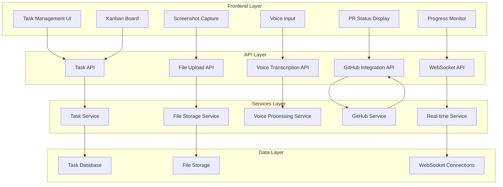

# Design Document

## Overview

This design document outlines the architecture for enhancing the existing task management system with advanced capabilities including visual bug reporting with screenshots, voice-dictated task creation, real-time task progress monitoring, kanban board visualization, and integrated PR status review. The solution leverages modern web APIs, external UI component libraries, and real-time communication patterns to create a comprehensive task management experience.

## Architecture

### High-Level Architecture



### Component Integration Strategy

The design integrates three external component libraries:
1. **OriginUI comp-547**: File upload component for screenshot handling
2. **Kibo-UI AI components**: Voice input and AI-powered features
3. **Kibo-UI Kanban components**: Drag-and-drop kanban board functionality

## Components and Interfaces

### 1. Screenshot Bug Reporting System

**Components:**
- `QuickBugReportButton`: Trigger for screenshot capture
- `ScreenshotCapture`: Handles screen capture using Web APIs
- `BugReportForm`: Form with screenshot annotation tools
- `ImageAnnotationTools`: Drawing tools for screenshot markup

**Key Interfaces:**
```typescript
interface ScreenshotData {
  id: string;
  imageBlob: Blob;
  timestamp: Date;
  annotations: Annotation[];
}

interface Annotation {
  type: 'arrow' | 'text' | 'highlight' | 'rectangle';
  position: { x: number; y: number };
  data: string | DrawingPath;
}

interface BugReport {
  id: string;
  title: string;
  description: string;
  screenshot: ScreenshotData;
  priority: 'low' | 'medium' | 'high' | 'critical';
  tags: string[];
}
```

### 2. Voice-Dictated Task Creation

**Components:**
- `VoiceInputButton`: Microphone activation button
- `VoiceRecorder`: Audio recording interface
- `TranscriptionProcessor`: Speech-to-text conversion
- `VoiceTaskForm`: Auto-populated task form

**Key Interfaces:**
```typescript
interface VoiceRecording {
  id: string;
  audioBlob: Blob;
  duration: number;
  timestamp: Date;
}

interface TranscriptionResult {
  text: string;
  confidence: number;
  language: string;
  segments: TranscriptionSegment[];
}

interface VoiceTask {
  transcription: TranscriptionResult;
  extractedData: {
    title: string;
    description: string;
    priority?: string;
    assignee?: string;
  };
}
```

### 3. Real-time Progress Monitoring

**Components:**
- `ProgressDashboard`: Main monitoring interface
- `TaskProgressCard`: Individual task progress display
- `ProgressIndicator`: Visual progress representation
- `AlertSystem`: Overdue and blocked task notifications

**Key Interfaces:**
```typescript
interface TaskProgress {
  taskId: string;
  status: TaskStatus;
  completionPercentage: number;
  timeSpent: number;
  estimatedTimeRemaining: number;
  lastUpdated: Date;
  isOverdue: boolean;
  isBlocked: boolean;
}

interface ProgressMetrics {
  totalTasks: number;
  completedTasks: number;
  inProgressTasks: number;
  overdueTasks: number;
  averageCompletionTime: number;
}
```

### 4. Kanban Board Visualization

**Components:**
- `KanbanBoard`: Main board container using Kibo-UI components
- `KanbanColumn`: Status-based columns
- `KanbanCard`: Draggable task cards
- `TaskFilters`: Filtering and search functionality

**Key Interfaces:**
```typescript
interface KanbanTask extends KanbanItemProps {
  id: string;
  name: string;
  column: string;
  priority: Priority;
  assignee: string;
  tags: string[];
  dueDate?: Date;
}

interface KanbanColumn extends KanbanColumnProps {
  id: string;
  name: string;
  maxItems?: number;
  color: string;
}
```

### 5. PR Status Integration

**Components:**
- `PRStatusCard`: PR information display
- `PRStatusBadge`: Status indicator
- `PRReviewSummary`: Review progress summary
- `PRActionButtons`: Quick action buttons

**Key Interfaces:**
```typescript
interface PRStatus {
  prId: string;
  title: string;
  status: 'draft' | 'open' | 'merged' | 'closed';
  reviewStatus: 'pending' | 'approved' | 'changes_requested';
  checks: PRCheck[];
  reviewers: Reviewer[];
  mergeable: boolean;
}

interface TaskPRLink {
  taskId: string;
  prId: string;
  repository: string;
  branch: string;
  autoUpdateStatus: boolean;
}
```

## Data Models

### Enhanced Task Model
```typescript
interface EnhancedTask {
  id: string;
  title: string;
  description: string;
  status: TaskStatus;
  priority: Priority;
  assignee: string;
  tags: string[];
  createdAt: Date;
  updatedAt: Date;
  dueDate?: Date;
  
  // New fields for enhancements
  creationMethod: 'manual' | 'voice' | 'bug_report';
  screenshots: ScreenshotData[];
  voiceRecording?: VoiceRecording;
  progress: TaskProgress;
  prLinks: TaskPRLink[];
  kanbanPosition: {
    column: string;
    order: number;
  };
}
```

### File Storage Model
```typescript
interface FileMetadata {
  id: string;
  filename: string;
  mimeType: string;
  size: number;
  uploadedAt: Date;
  taskId: string;
  type: 'screenshot' | 'voice_recording' | 'attachment';
  url: string;
}
```

## Error Handling

### Screenshot Capture Errors
- Browser permission denied
- Screen capture API not supported
- File size limitations
- Upload failures

### Voice Input Errors
- Microphone permission denied
- Speech recognition API unavailable
- Transcription failures
- Audio quality issues

### Real-time Connection Errors
- WebSocket connection failures
- Network interruptions
- Server unavailability
- Data synchronization conflicts

### GitHub Integration Errors
- API rate limiting
- Authentication failures
- Repository access issues
- Webhook delivery failures

## Testing Strategy

### Unit Testing
- Component rendering and behavior
- API endpoint functionality
- Data transformation logic
- Error handling scenarios

### Integration Testing
- File upload workflows
- Voice transcription accuracy
- Real-time data synchronization
- GitHub API integration

### End-to-End Testing
- Complete bug reporting workflow
- Voice task creation process
- Kanban board interactions
- PR status updates

### Performance Testing
- File upload performance
- Real-time update latency
- Large dataset handling
- Concurrent user scenarios

### Accessibility Testing
- Screen reader compatibility
- Keyboard navigation
- Voice input alternatives
- Color contrast compliance

## Security Considerations

### File Upload Security
- File type validation
- Size limitations
- Malware scanning
- Secure storage

### Voice Data Privacy
- Audio data encryption
- Temporary storage policies
- User consent management
- Data retention limits

### API Security
- Authentication tokens
- Rate limiting
- Input validation
- CORS policies

### Real-time Communication Security
- WebSocket authentication
- Message encryption
- Connection validation
- DoS protection

## Performance Optimization

### File Handling
- Image compression for screenshots
- Progressive upload for large files
- CDN integration for file delivery
- Caching strategies

### Real-time Updates
- Efficient WebSocket message batching
- Selective data synchronization
- Connection pooling
- Graceful degradation

### Voice Processing
- Client-side audio preprocessing
- Streaming transcription
- Background processing
- Result caching

### UI Performance
- Virtual scrolling for large kanban boards
- Lazy loading of task details
- Optimistic UI updates
- Component memoization