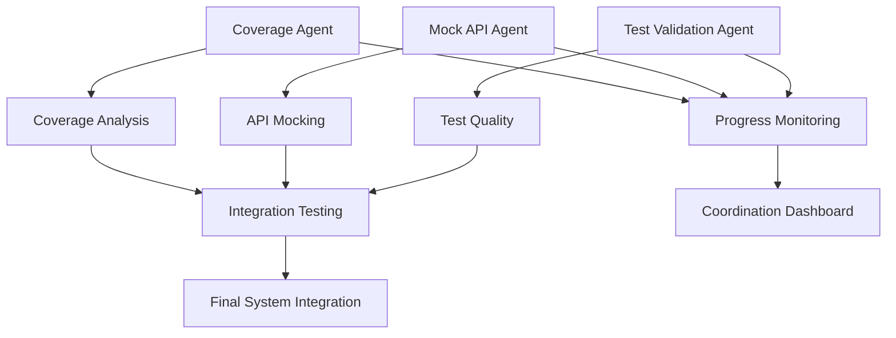

# Testing Infrastructure Coordination Framework

## Executive Summary

This document establishes the coordination framework for three specialized agents working on the testing infrastructure:

1. **Coverage Agent** - Manages coverage analysis and reporting
2. **Mock API Agent** - Handles API mocking and integration testing
3. **Test Validation Agent** - Ensures test quality and validation

## Current Testing Infrastructure State

### Multi-Tier Testing Setup Status

**✅ Tier 1: Bun Unit Tests**
- Status: Fully functional with excellent performance (45ms for 4 tests)
- Coverage: Basic functional coverage with lcov/text reporting
- Issues: React component tests failing due to missing DOM environment

**⚠️ Tier 2: Vitest Integration Tests**
- Status: Configured but experiencing timeout issues (>2 minutes)
- Coverage: Configured but not testable due to timeouts
- Issues: Complex API mocking causing hanging tests

**✅ Tier 3: Playwright E2E Tests**
- Status: Functional with comprehensive browser coverage
- Coverage: Cross-browser testing (Chrome, Firefox, Safari, Mobile)
- Issues: None critical

### Coverage Analysis Summary

```
File Coverage Status:
- Functions: 7.21% (Target: 80%)
- Lines: 27.06% (Target: 80%)
- Critical Gap: 72.79% improvement needed
```

## Agent Coordination Matrix

### Coverage Agent Responsibilities

| Task | Priority | Dependencies | Integration Points |
|------|----------|--------------|-------------------|
| Analyze current coverage gaps | High | None | Test Validation Agent |
| Configure multi-tier coverage | High | Test setup | Mock API Agent |
| Create coverage dashboards | Medium | Data collection | Progress monitoring |
| Implement coverage gates | Medium | Thresholds | CI/CD integration |
| Generate coverage reports | Low | All tests running | Final integration |

### Mock API Agent Responsibilities

| Task | Priority | Dependencies | Integration Points |
|------|----------|--------------|-------------------|
| Fix integration test timeouts | High | None | Test Validation Agent |
| Simplify complex API mocking | High | Timeout analysis | Coverage Agent |
| Create mock API framework | Medium | Test infrastructure | All agents |
| Implement API test patterns | Medium | Mock framework | Test Validation Agent |
| Optimize mock performance | Low | Framework complete | Coverage Agent |

### Test Validation Agent Responsibilities

| Task | Priority | Dependencies | Integration Points |
|------|----------|--------------|-------------------|
| Validate test tier separation | High | None | All agents |
| Fix Bun unit test DOM issues | High | Test environment | Coverage Agent |
| Create validation framework | Medium | Test patterns | Mock API Agent |
| Implement quality gates | Medium | Validation rules | Coverage Agent |
| Validate final integration | Low | All systems ready | Coordination |

## Integration Dependencies Map



## Critical Integration Points

### 1. Test Environment Configuration
- **Shared Responsibility**: All agents
- **Conflict Risk**: High - Different environment requirements
- **Resolution**: Establish common test environment standards

### 2. Coverage Data Collection
- **Primary**: Coverage Agent
- **Secondary**: Mock API Agent (API coverage), Test Validation Agent (validation coverage)
- **Conflict Risk**: Medium - Overlapping coverage areas
- **Resolution**: Define coverage boundaries clearly

### 3. Test Framework Integration
- **Primary**: Test Validation Agent
- **Secondary**: All agents use validation framework
- **Conflict Risk**: Medium - Framework compatibility
- **Resolution**: Establish framework compatibility matrix

## Coordination Protocols

### Communication Standards

1. **Status Updates**: Every 2 hours or after major milestone
2. **Conflict Escalation**: Immediate notification to coordinator
3. **Progress Reporting**: Standardized format with metrics
4. **Integration Testing**: Coordinated testing windows

### Conflict Resolution Process

1. **Identify Conflict**: Agent reports incompatibility
2. **Assess Impact**: Coordinator evaluates severity
3. **Propose Solutions**: All affected agents contribute
4. **Implement Resolution**: Coordinated implementation
5. **Validate Fix**: Cross-agent testing

### Quality Assurance Gates

| Gate | Criteria | Responsible Agent | Validation |
|------|----------|-------------------|------------|
| Coverage Standards | >80% for critical paths | Coverage Agent | Test Validation Agent |
| Mock API Performance | <100ms response time | Mock API Agent | All agents |
| Test Reliability | <1% flaky test rate | Test Validation Agent | Coverage Agent |
| Integration Stability | All tiers pass consistently | All agents | Coordinator |

## Progress Monitoring Framework

### Key Performance Indicators

1. **Coverage Metrics**
   - Function coverage: Target 80%
   - Line coverage: Target 80%
   - Branch coverage: Target 75%

2. **Test Performance**
   - Unit test execution: <60 seconds
   - Integration test execution: <120 seconds
   - E2E test execution: <300 seconds

3. **Integration Health**
   - Cross-agent compatibility: 100%
   - Framework conflicts: 0
   - Blocking issues: 0

### Status Dashboard

```
Agent Status Dashboard:
┌─────────────────────┬──────────┬─────────────┬──────────────┐
│ Agent               │ Status   │ Progress    │ Blockers     │
├─────────────────────┼──────────┼─────────────┼──────────────┤
│ Coverage Agent      │ Active   │ 25%         │ 0            │
│ Mock API Agent      │ Pending  │ 0%          │ 1 (timeout)  │
│ Test Validation     │ Pending  │ 0%          │ 1 (DOM env)  │
│ Integration         │ Pending  │ 0%          │ 2            │
└─────────────────────┴──────────┴─────────────┴──────────────┘
```

## Risk Management

### High-Risk Areas

1. **Integration Test Timeouts**
   - Impact: Blocks Mock API Agent progress
   - Mitigation: Immediate analysis and simplification
   - Contingency: Isolate problematic tests

2. **Coverage Data Conflicts**
   - Impact: Inaccurate coverage reporting
   - Mitigation: Clear coverage boundaries
   - Contingency: Separate coverage domains

3. **Framework Incompatibilities**
   - Impact: System integration failure
   - Mitigation: Compatibility testing
   - Contingency: Framework abstraction layer

### Contingency Plans

1. **Agent Failure Recovery**
   - Backup coordination protocols
   - Task redistribution mechanisms
   - Emergency fallback procedures

2. **Integration Failure Recovery**
   - Rollback procedures
   - Incremental integration approach
   - Isolated testing environments

## Success Criteria

### Individual Agent Success

- **Coverage Agent**: Coverage >80%, reporting functional
- **Mock API Agent**: Integration tests <30s, mock framework complete
- **Test Validation Agent**: All test tiers validated, quality gates active

### Overall Coordination Success

- **System Integration**: All components work together seamlessly
- **Performance**: Test suite execution <10 minutes total
- **Reliability**: <1% test flakiness rate
- **Maintainability**: Clear documentation and handoff procedures

## Next Steps

1. **Immediate Actions** (Next 2 hours)
   - Analyze integration test timeout issues
   - Establish agent communication channels
   - Begin coverage gap analysis

2. **Short-term Goals** (Next 24 hours)
   - Fix critical blocking issues
   - Establish working frameworks
   - Complete initial integration tests

3. **Long-term Objectives** (Next week)
   - Full system integration
   - Comprehensive testing
   - Documentation and handoff

## Coordination Timeline

```
Phase 1 (Hours 1-4): Foundation
- Agent setup and communication
- Critical issue analysis
- Framework establishment

Phase 2 (Hours 5-12): Development
- Individual agent deliverables
- Integration testing
- Conflict resolution

Phase 3 (Hours 13-24): Integration
- System integration
- Final validation
- Documentation

Phase 4 (Hours 25-48): Handoff
- System validation
- Performance optimization
- Knowledge transfer
```

---

*This coordination framework will be updated as agents progress and new requirements emerge.*