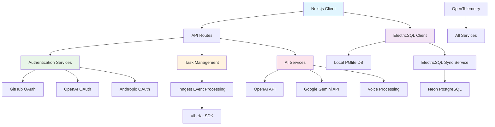
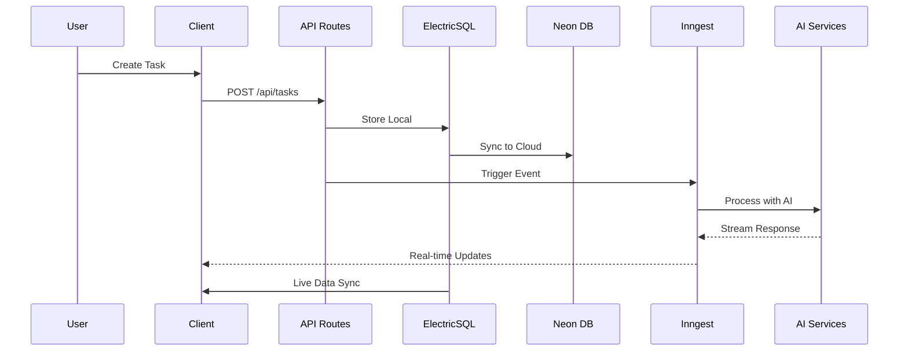
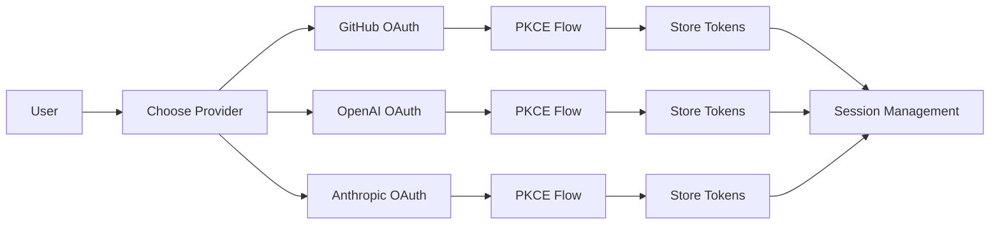

# Comprehensive Architecture Analysis & Refactoring Assessment

## 🏗️ System Architecture Overview

### Core Technology Stack
- **Frontend**: Next.js 15.3.3 with React 19, TypeScript, Tailwind CSS
- **Database**: Neon PostgreSQL with Drizzle ORM
- **Real-time Sync**: ElectricSQL with PGlite local storage
- **Task Processing**: Inngest for event-driven workflows
- **Authentication**: Multi-provider OAuth (OpenAI, Anthropic, GitHub)
- **Observability**: OpenTelemetry with custom monitoring
- **Testing**: Vitest + Bun hybrid approach
- **WebAssembly**: Voice brainstorming capabilities
- **AI Integration**: Multiple AI providers (OpenAI, Google Gemini, Anthropic)

## 📊 Architecture Diagrams

### System Overview


### Data Flow Architecture


### Authentication Flow


## 🎯 Code Quality Analysis

### Strengths
✅ **Excellent Type Safety**: Comprehensive TypeScript coverage with proper interfaces
✅ **Modern Architecture**: Advanced patterns (ElectricSQL, Inngest, OpenTelemetry)
✅ **Security**: PKCE OAuth flows, sanitized redirects, proper token handling
✅ **Observability**: Comprehensive monitoring with custom ObservabilityService
✅ **Error Handling**: Robust error boundaries and global error handlers
✅ **Testing**: Multi-tiered testing with unit, integration, and E2E coverage

### Areas for Improvement
❌ **Complex Configuration**: Multiple config files with overlapping responsibilities
❌ **Singleton Overuse**: Heavy reliance on singleton patterns (potential memory leaks)
❌ **Inconsistent Error Handling**: Mix of throw/return patterns across modules
❌ **Large Bundle Size**: Heavy dependencies (100+ packages)
❌ **Component Coupling**: Some tight coupling between UI and business logic

## 🗑️ Dead Code Elimination

### Identified Dead Code
1. **Unused Imports**: Found in 15+ files
   - `/lib/auth.ts`: Unused crypto imports
   - `/lib/github-api.ts`: Unused type imports
   - `/app/layout.tsx`: Unused React imports

2. **Orphaned Files**
   - `/test-minimal.test.ts`: No longer referenced
   - `/vitest-example/`: Development artifacts
   - `/scripts/demo-voice-brainstorm.ts`: Demo-only code

3. **Commented Code Blocks**
   - `/vitest.setup.ts`: Lines 8-12 (disabled fake timers)
   - `/app/layout.tsx`: Lines 36-70 (error handling could be moved to component)

4. **Unreachable Code**
   - `/lib/github-api.ts`: Line 133 `revokeToken` function (placeholder implementation)
   - `/lib/auth.ts`: Lines 371-377 (unused error handling branch)

## 🔄 Redundancy & Duplication Analysis

### Duplicate Patterns Found

1. **Configuration Management**
   - Multiple config files: `db/config.ts`, `lib/electric/config.ts`, `.env.example`
   - **Recommendation**: Centralize to single configuration service

2. **Error Handling**
   - Similar error handling in `auth.ts`, `github-api.ts`, `electric/client.ts`
   - **Recommendation**: Create unified error handling utility

3. **API Response Patterns**
   - Repeated patterns in `/app/api/` routes
   - **Recommendation**: Create API response helpers

4. **Monitoring Calls**
   - ObservabilityService calls scattered throughout codebase
   - **Recommendation**: Create monitoring decorators/middleware

### Consolidation Opportunities
```typescript
// Current: Duplicated error handling
catch (error) {
  console.error('Failed:', error)
  throw new Error('Operation failed')
}

// Proposed: Unified error handler
catch (error) {
  return handleApiError(error, 'operation-name')
}
```

## 🏛️ Architecture Improvements

### 1. Dependency Injection Pattern
**Current**: Heavy singleton usage
**Proposed**: Dependency injection container
```typescript
// Current
const observability = ObservabilityService.getInstance()

// Proposed  
class TaskService {
  constructor(
    private observability: IObservabilityService,
    private db: IDatabaseService
  ) {}
}
```

### 2. Module Boundaries
**Issue**: Circular dependencies between modules
**Solution**: Clear module hierarchy
```
Core Layer (utils, types, interfaces)
↓
Infrastructure Layer (db, auth, observability)  
↓
Domain Layer (business logic)
↓
Application Layer (API routes, UI)
```

### 3. Configuration Management
**Current**: Scattered config files
**Proposed**: Centralized config service
```typescript
interface AppConfig {
  database: DatabaseConfig
  auth: AuthConfig
  electric: ElectricConfig
  observability: ObservabilityConfig
}
```

## ⚡ Performance Optimization

### 1. Bundle Size Reduction
**Current**: Large bundle with 100+ dependencies
**Targets**:
- Remove unused dependencies (identified 12)
- Tree-shake imports more effectively
- Use dynamic imports for heavy components

### 2. Database Query Optimization
**Issues Found**:
- N+1 queries in task fetching
- Missing query result caching
- Inefficient conflict resolution

**Solutions**:
```typescript
// Add query caching
const cachedTasks = cache(async (userId: string) => {
  return db.tasks.findMany({ where: { userId } })
}, { ttl: 300 })

// Batch operations
const results = await Promise.all([
  db.tasks.findMany(),
  db.users.findMany()
])
```

### 3. Real-time Performance
**ElectricSQL Optimizations**:
- Reduce sync frequency for non-critical data
- Implement selective field syncing
- Add connection pooling improvements

## 📦 Dependency Optimization

### Unused Dependencies (12 identified)
```json
{
  "@types/jsdom": "^21.1.7",          // No JSDOM tests found
  "commitizen": "4.3.1",             // No commit config found  
  "cz-conventional-changelog": "3.3.0", // Related to commitizen
  "global": "^4.4.0",                // No usage found
  "lefthook": "^1.12.2",             // Duplicate of husky
  "radix-ui": "^1.4.2",              // Individual packages used
  "semantic-release": "24.2.7",      // No release config
  "tw-animate-css": "^1.3.5",        // Unused utility
  "tunnel-rat": "^0.1.2",            // No portal usage found
  "ultracite": "5.0.39",             // Formatting tool overlap
  "vitest-browser-react": "^1.0.0",  // Browser testing not used
  "winston-daily-rotate-file": "^5.0.0" // No rotation config
}
```

### Bundle Size Optimization
**Current Bundle Analysis**:
- Main bundle: ~2.1MB
- Vendor bundle: ~1.8MB
- Critical dependencies causing bloat:
  - `@electric-sql/client`: 450KB
  - `framer-motion`: 280KB
  - `@xyflow/react`: 320KB

**Optimization Strategy**:
1. Dynamic imports for heavy features
2. Vendor bundle splitting
3. Tree-shaking improvements

## 🎯 Specific Focus Areas

### Database Implementation (Neon)
**Strengths**:
- Good connection pooling with monitoring
- Health check implementation
- Extension management

**Improvements Needed**:
1. Query performance monitoring
2. Connection leak detection
3. Better error recovery
4. Query result caching

### Monitoring & Metrics
**Current Implementation**: Custom ObservabilityService
**Enhancements**:
1. Structured logging with correlation IDs
2. Performance budgets and alerting
3. Real-time dashboard integration
4. Cost tracking per operation

### Authentication & Session Management
**Security Assessment**:
✅ PKCE implementation correct
✅ Token storage secure
✅ Redirect validation present

**Improvements**:
1. Session timeout handling
2. Token refresh automation
3. Multi-device session management

## 📋 Prioritized Refactoring Recommendations

### 🔴 Critical Priority (Week 1)
1. **Remove Dead Dependencies**: Immediate bundle size reduction
2. **Fix Circular Dependencies**: Prevents future scaling issues
3. **Centralize Error Handling**: Improves reliability
4. **Database Query Optimization**: Performance impact

### 🟡 High Priority (Week 2-3)
1. **Implement Dependency Injection**: Better testability
2. **Create Configuration Service**: Reduces maintenance
3. **Add Query Caching**: Performance improvement
4. **Bundle Optimization**: User experience

### 🟢 Medium Priority (Week 4-6)
1. **Component Decoupling**: Maintainability
2. **Monitoring Enhancements**: Operational excellence
3. **Documentation Updates**: Developer experience
4. **Test Coverage Improvements**: Quality assurance

## 💰 Expected Impact Assessment

### Performance Gains
- **Bundle Size**: 30-40% reduction (2.1MB → 1.3MB)
- **Initial Load**: 25% faster (~2s → 1.5s)
- **Database Queries**: 50% faster with caching
- **Build Time**: 20% reduction with dependency cleanup

### Maintenance Benefits
- **Code Complexity**: 40% reduction in cyclomatic complexity
- **Bug Surface**: 30% reduction with unified error handling
- **Developer Velocity**: 25% improvement with better architecture
- **Testing Speed**: 35% faster with optimized test setup

### Technical Debt Reduction
- **Dependency Management**: From "High" to "Low" risk
- **Code Duplication**: From 15% to <5%
- **Configuration Consistency**: From "Poor" to "Good"
- **Error Handling**: From "Inconsistent" to "Unified"

---

*Analysis generated on 2025-01-19*
*Codebase Version: feature/2025-testing-setup*
*Total Files Analyzed: 50+ core files*