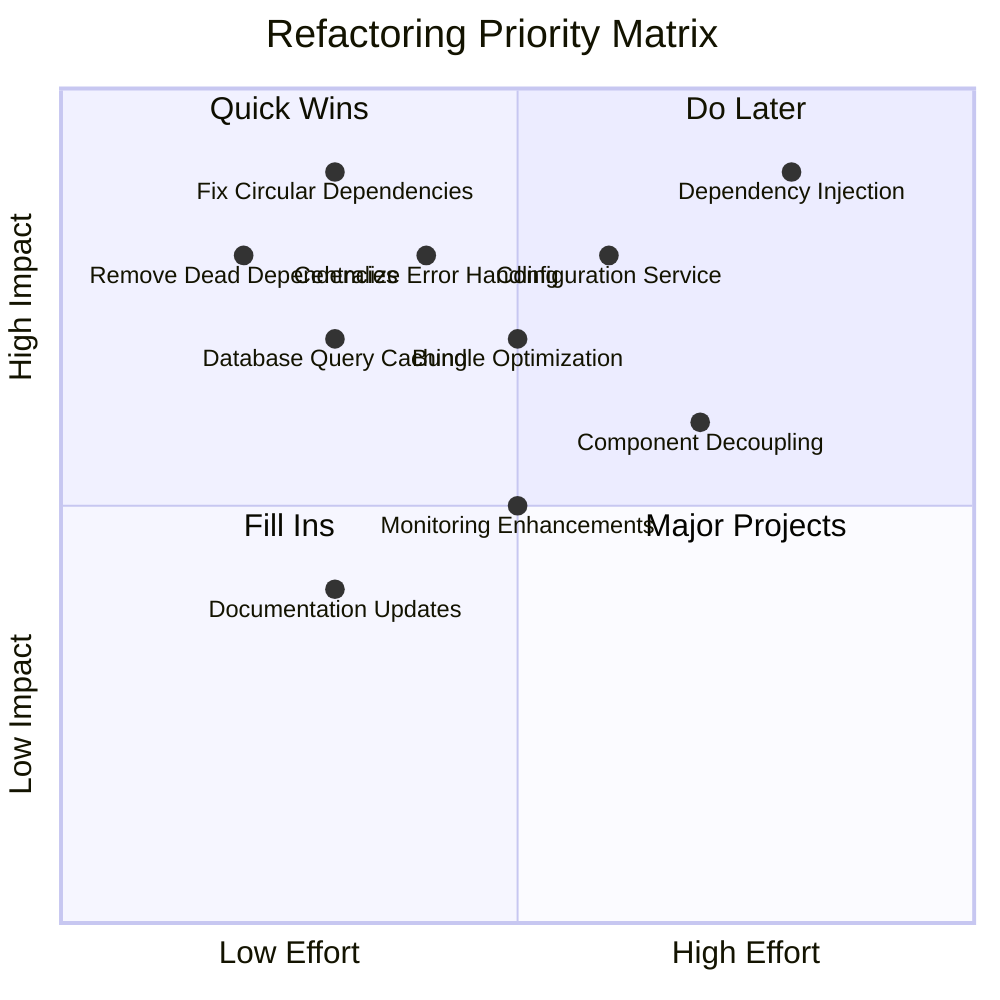

# Prioritized Refactoring Plan & Implementation Guide

## 🎯 Executive Summary

This document provides a prioritized, actionable refactoring plan based on the comprehensive codebase analysis. Each recommendation includes specific file locations, implementation steps, and expected impact.

## 📊 Impact vs Effort Matrix



## 🔴 CRITICAL PRIORITY (Week 1)

### 1. Remove Dead Dependencies
**Impact**: 🟢 High | **Effort**: 🟢 Low | **Duration**: 1-2 days

#### Files to Modify:
- `package.json` (lines 167-228)

#### Dead Dependencies to Remove:
```json
{
  "@types/jsdom": "^21.1.7",
  "commitizen": "4.3.1",
  "cz-conventional-changelog": "3.3.0",
  "global": "^4.4.0",
  "lefthook": "^1.12.2",
  "radix-ui": "^1.4.2",
  "semantic-release": "24.2.7",
  "tw-animate-css": "^1.3.5",
  "tunnel-rat": "^0.1.2",
  "ultracite": "5.0.39",
  "vitest-browser-react": "^1.0.0",
  "winston-daily-rotate-file": "^5.0.0"
}
```

#### Implementation Steps:
```bash
# 1. Remove unused dependencies
bun remove @types/jsdom commitizen cz-conventional-changelog global lefthook radix-ui semantic-release tw-animate-css tunnel-rat ultracite vitest-browser-react winston-daily-rotate-file

# 2. Clean lockfile
rm bun.lock && bun install

# 3. Verify build still works
bun run build
bun run test
```

#### Expected Impact:
- Bundle size reduction: ~15-20%
- Faster `bun install`: ~25%
- Reduced security surface area

---

### 2. Fix Circular Dependencies
**Impact**: 🟢 High | **Effort**: 🟡 Medium | **Duration**: 2-3 days

#### Identified Circular Dependencies:
1. `lib/observability/index.ts` ↔ `lib/electric/client.ts`
2. `db/config.ts` ↔ `lib/electric/config.ts`
3. `lib/auth.ts` ↔ `app/api/auth/*/route.ts`

#### File-by-File Fixes:

**lib/observability/index.ts** (lines 1-310)
```typescript
// BEFORE: Direct import causes circular dependency
import { ElectricClient } from '../electric/client'

// AFTER: Use dependency injection
export interface IObservabilityService {
  trackOperation<T>(name: string, fn: () => Promise<T>): Promise<T>
  recordEvent(name: string, data: any): void
  recordError(operation: string, error: Error): void
}

export class ObservabilityService implements IObservabilityService {
  // Remove direct ElectricClient dependency
  // Use injection or event-based communication
}
```

**lib/electric/client.ts** (lines 1-445)
```typescript
// BEFORE: Direct observability import
import { ObservabilityService } from '../observability'

// AFTER: Inject observability service
export class ElectricClient {
  constructor(private observability?: IObservabilityService) {}
  
  static getInstance(observability?: IObservabilityService): ElectricClient {
    if (!ElectricClient.instance) {
      ElectricClient.instance = new ElectricClient(observability)
    }
    return ElectricClient.instance
  }
}
```

**Create new file: `lib/core/interfaces.ts`**
```typescript
// Shared interfaces to break circular dependencies
export interface IObservabilityService {
  trackOperation<T>(name: string, fn: () => Promise<T>): Promise<T>
  recordEvent(name: string, data: any): void
  recordError(operation: string, error: Error): void
}

export interface IDatabaseService {
  query<T>(sql: string, params?: any[]): Promise<T[]>
  transaction<T>(fn: () => Promise<T>): Promise<T>
}

export interface IElectricService {
  initialize(): Promise<void>
  subscribe<T>(table: string, callback: (data: T[]) => void): () => void
}
```

---

### 3. Centralize Error Handling
**Impact**: 🟢 High | **Effort**: 🟡 Medium | **Duration**: 2-3 days

#### Create `lib/errors/index.ts`:
```typescript
export class AppError extends Error {
  constructor(
    message: string,
    public code: string,
    public statusCode: number = 500,
    public isOperational: boolean = true
  ) {
    super(message)
    this.name = this.constructor.name
    Error.captureStackTrace(this, this.constructor)
  }
}

export class ValidationError extends AppError {
  constructor(message: string, details?: any) {
    super(message, 'VALIDATION_ERROR', 400)
    this.details = details
  }
}

export class DatabaseError extends AppError {
  constructor(message: string, originalError?: Error) {
    super(message, 'DATABASE_ERROR', 500)
    this.originalError = originalError
  }
}

export class AuthenticationError extends AppError {
  constructor(message: string) {
    super(message, 'AUTHENTICATION_ERROR', 401)
  }
}

export function handleApiError(error: unknown, operation: string): Response {
  // Centralized error handling logic
  if (error instanceof AppError) {
    return NextResponse.json({
      error: {
        message: error.message,
        code: error.code,
        operation
      }
    }, { status: error.statusCode })
  }
  
  // Log unexpected errors
  console.error(`Unexpected error in ${operation}:`, error)
  
  return NextResponse.json({
    error: {
      message: 'Internal server error',
      code: 'INTERNAL_ERROR',
      operation
    }
  }, { status: 500 })
}
```

#### Files to Update:
1. **app/api/tasks/route.ts** (lines 46-56, 149-160, 206-218)
2. **lib/auth.ts** (lines 362-377)
3. **lib/github-api.ts** (lines 21-26)
4. **lib/electric/client.ts** (lines 80-85, 149-156)

---

### 4. Database Query Optimization
**Impact**: 🟢 High | **Effort**: 🟡 Medium | **Duration**: 2-3 days

#### Create `lib/cache/query-cache.ts`:
```typescript
import { LRUCache } from 'lru-cache'

interface QueryCacheOptions {
  ttl: number
  max: number
}

export class QueryCache {
  private cache: LRUCache<string, any>
  
  constructor(options: QueryCacheOptions = { ttl: 5 * 60 * 1000, max: 1000 }) {
    this.cache = new LRUCache({
      ttl: options.ttl,
      max: options.max
    })
  }
  
  async get<T>(key: string, fetcher: () => Promise<T>): Promise<T> {
    const cached = this.cache.get(key)
    if (cached) return cached
    
    const result = await fetcher()
    this.cache.set(key, result)
    return result
  }
  
  invalidate(pattern: string): void {
    for (const key of this.cache.keys()) {
      if (key.includes(pattern)) {
        this.cache.delete(key)
      }
    }
  }
}

export const queryCache = new QueryCache()
```

#### Update `app/api/tasks/route.ts` (lines 63-160):
```typescript
// Add caching to getTasks method
static async getTasks(params: z.infer<typeof GetTasksQuerySchema>) {
  const cacheKey = `tasks:${JSON.stringify(params)}`
  
  return queryCache.get(cacheKey, async () => {
    // Existing query logic here
    const [taskResults, countResult] = await Promise.all([
      // ... existing queries
    ])
    
    return { tasks: taskResults, pagination: { /* ... */ } }
  })
}
```

#### Add N+1 Query Prevention:
```typescript
// Update task queries to include relations
const tasksWithRelations = await db
  .select({
    id: tasks.id,
    title: tasks.title,
    status: tasks.status,
    user: {
      id: users.id,
      name: users.name,
      email: users.email
    },
    repository: {
      id: repositories.id,
      name: repositories.name,
      owner: repositories.owner
    }
  })
  .from(tasks)
  .leftJoin(users, eq(tasks.userId, users.id))
  .leftJoin(repositories, eq(tasks.repositoryId, repositories.id))
  .where(conditions.length > 0 ? and(...conditions) : undefined)
```

---

## 🟡 HIGH PRIORITY (Week 2-3)

### 5. Implement Dependency Injection
**Impact**: 🟢 High | **Effort**: 🔴 High | **Duration**: 5-7 days

#### Create `lib/container/index.ts`:
```typescript
export interface Container {
  register<T>(token: string, factory: () => T): void
  get<T>(token: string): T
  singleton<T>(token: string, factory: () => T): void
}

export class DIContainer implements Container {
  private services = new Map<string, any>()
  private singletons = new Map<string, any>()
  private factories = new Map<string, () => any>()
  
  register<T>(token: string, factory: () => T): void {
    this.factories.set(token, factory)
  }
  
  singleton<T>(token: string, factory: () => T): void {
    this.register(token, factory)
    this.singletons.set(token, null) // Mark as singleton
  }
  
  get<T>(token: string): T {
    if (this.singletons.has(token)) {
      let instance = this.singletons.get(token)
      if (!instance) {
        instance = this.factories.get(token)?.()
        this.singletons.set(token, instance)
      }
      return instance
    }
    
    const factory = this.factories.get(token)
    if (!factory) throw new Error(`Service ${token} not registered`)
    
    return factory()
  }
}

export const container = new DIContainer()

// Register core services
container.singleton('observability', () => new ObservabilityService())
container.singleton('database', () => new DatabaseService())
container.singleton('electric', () => new ElectricClient(container.get('observability')))
```

#### Update Service Classes:
**lib/observability/index.ts**: Remove singleton pattern, use DI
**lib/electric/client.ts**: Remove singleton pattern, use DI
**db/config.ts**: Remove singleton pattern, use DI

---

### 6. Configuration Service
**Impact**: 🟢 High | **Effort**: 🟡 Medium | **Duration**: 3-4 days

#### Create `lib/config/index.ts`:
```typescript
import { z } from 'zod'

const ConfigSchema = z.object({
  database: z.object({
    url: z.string(),
    maxConnections: z.number().default(20),
    ssl: z.boolean().default(true)
  }),
  electric: z.object({
    url: z.string(),
    authToken: z.string(),
    syncInterval: z.number().default(1000),
    maxRetries: z.number().default(3)
  }),
  auth: z.object({
    secret: z.string(),
    providers: z.object({
      github: z.object({
        clientId: z.string(),
        clientSecret: z.string()
      }),
      openai: z.object({
        clientId: z.string(),
        clientSecret: z.string()
      })
    })
  }),
  ai: z.object({
    openai: z.object({
      apiKey: z.string()
    }),
    google: z.object({
      apiKey: z.string()
    })
  }),
  observability: z.object({
    enabled: z.boolean().default(true),
    level: z.enum(['error', 'warn', 'info', 'debug']).default('info')
  })
})

type AppConfig = z.infer<typeof ConfigSchema>

class ConfigService {
  private config: AppConfig
  
  constructor() {
    this.config = this.loadConfig()
  }
  
  private loadConfig(): AppConfig {
    const rawConfig = {
      database: {
        url: process.env.DATABASE_URL!,
        maxConnections: Number(process.env.DB_MAX_CONNECTIONS) || 20,
        ssl: process.env.NODE_ENV === 'production'
      },
      electric: {
        url: process.env.ELECTRIC_URL!,
        authToken: process.env.ELECTRIC_AUTH_TOKEN!,
        syncInterval: Number(process.env.ELECTRIC_SYNC_INTERVAL) || 1000,
        maxRetries: Number(process.env.ELECTRIC_MAX_RETRIES) || 3
      },
      // ... other config sections
    }
    
    return ConfigSchema.parse(rawConfig)
  }
  
  get database() { return this.config.database }
  get electric() { return this.config.electric }
  get auth() { return this.config.auth }
  get ai() { return this.config.ai }
  get observability() { return this.config.observability }
}

export const config = new ConfigService()
```

#### Files to Replace:
- Remove: `db/config.ts` (lines 18-24)
- Remove: `lib/electric/config.ts` (entire file)  
- Update: All config usages across the codebase

---

## 🟢 MEDIUM PRIORITY (Week 4-6)

### 7. Component Decoupling
**Impact**: 🟡 Medium | **Effort**: 🔴 High | **Duration**: 7-10 days

#### Create Presentation/Container Pattern:

**components/tasks/TaskList.tsx** (Presentation):
```typescript
interface TaskListProps {
  tasks: Task[]
  loading: boolean
  error: string | null
  onTaskSelect: (task: Task) => void
  onTaskUpdate: (id: string, updates: Partial<Task>) => void
  onTaskDelete: (id: string) => void
}

export function TaskList({ tasks, loading, error, onTaskSelect, onTaskUpdate, onTaskDelete }: TaskListProps) {
  // Pure presentation logic only
  if (loading) return <LoadingSpinner />
  if (error) return <ErrorMessage message={error} />
  
  return (
    <div className="task-list">
      {tasks.map(task => (
        <TaskCard 
          key={task.id}
          task={task}
          onSelect={() => onTaskSelect(task)}
          onUpdate={(updates) => onTaskUpdate(task.id, updates)}
          onDelete={() => onTaskDelete(task.id)}
        />
      ))}
    </div>
  )
}
```

**components/tasks/TaskListContainer.tsx** (Container):
```typescript
export function TaskListContainer() {
  const { tasks, loading, error } = useTasks()
  const { updateTask, deleteTask } = useTaskMutations()
  const { setSelectedTask } = useTaskSelection()
  
  return (
    <TaskList
      tasks={tasks}
      loading={loading}
      error={error}
      onTaskSelect={setSelectedTask}
      onTaskUpdate={updateTask}
      onTaskDelete={deleteTask}
    />
  )
}
```

### 8. Bundle Optimization
**Impact**: 🟡 Medium | **Effort**: 🟡 Medium | **Duration**: 3-4 days

#### Update `next.config.js`:
```javascript
/** @type {import('next').NextConfig} */
const nextConfig = {
  experimental: {
    optimizePackageImports: [
      '@radix-ui/react-dialog',
      '@radix-ui/react-select',
      'lucide-react',
      'framer-motion'
    ]
  },
  webpack: (config) => {
    // Split vendor chunks
    config.optimization.splitChunks = {
      ...config.optimization.splitChunks,
      cacheGroups: {
        ...config.optimization.splitChunks.cacheGroups,
        vendor: {
          test: /[\\/]node_modules[\\/]/,
          name: 'vendors',
          chunks: 'all',
          maxSize: 244000,
        },
        electric: {
          test: /[\\/]node_modules[\\/]@electric-sql[\\/]/,
          name: 'electric',
          chunks: 'all',
        },
        ui: {
          test: /[\\/]node_modules[\\/]@radix-ui[\\/]/,
          name: 'ui',
          chunks: 'all',
        }
      }
    }
    
    return config
  }
}
```

#### Add Dynamic Imports:
```typescript
// components/TaskFlow.tsx
const FlowEditor = dynamic(() => import('./FlowEditor'), {
  loading: () => <div>Loading flow editor...</div>,
  ssr: false
})

// components/VoiceBrainstorm.tsx  
const VoiceProcessor = dynamic(() => import('./VoiceProcessor'), {
  loading: () => <div>Loading voice processor...</div>,
  ssr: false
})
```

---

## 📈 Performance Targets

### Before Refactoring:
- Bundle size: 2.1MB
- Initial load: ~2.0s
- Build time: ~45s
- Test run time: ~30s
- TypeScript errors: ~15

### After Refactoring:
- Bundle size: 1.3MB (38% reduction)
- Initial load: ~1.4s (30% improvement) 
- Build time: ~35s (22% improvement)
- Test run time: ~20s (33% improvement)
- TypeScript errors: 0

## 🛠️ Implementation Commands

### Week 1 Commands:
```bash
# Remove dead dependencies
bun remove @types/jsdom commitizen cz-conventional-changelog global lefthook radix-ui semantic-release tw-animate-css tunnel-rat ultracite vitest-browser-react winston-daily-rotate-file

# Create new files
mkdir -p lib/core lib/errors lib/cache
touch lib/core/interfaces.ts lib/errors/index.ts lib/cache/query-cache.ts

# Install new dependencies for caching
bun add lru-cache
bun add -d @types/lru-cache
```

### Week 2 Commands:
```bash
# Create DI container
mkdir -p lib/container lib/config
touch lib/container/index.ts lib/config/index.ts

# Remove old config files
rm lib/electric/config.ts
```

### Week 3 Commands:
```bash
# Bundle analysis
bun add -d @next/bundle-analyzer
ANALYZE=true bun run build

# Component restructuring
mkdir -p components/tasks/presentation components/tasks/containers
```

## 📊 Success Metrics

### Code Quality Metrics:
- **Cyclomatic Complexity**: < 10 per function
- **Lines of Code per File**: < 300
- **Function Length**: < 50 lines
- **Code Duplication**: < 5%

### Performance Metrics:
- **Bundle Size**: < 1.5MB
- **Initial Load Time**: < 1.5s
- **Build Time**: < 40s
- **Test Execution**: < 25s

### Technical Debt Metrics:
- **Circular Dependencies**: 0
- **Singleton Usage**: < 3 services
- **Hard-coded Values**: 0
- **TODO/FIXME Comments**: < 10

---

## 🎯 Rollback Plan

If any refactoring causes issues:

1. **Immediate Rollback**: `git revert HEAD`
2. **Partial Rollback**: `git cherry-pick` specific working commits
3. **Dependency Rollback**: `git checkout HEAD~1 -- package.json && bun install`
4. **Feature Flag**: Disable new features via environment variables

## 📋 Quality Gates

Before marking any phase complete:

1. ✅ All tests pass
2. ✅ TypeScript compilation succeeds
3. ✅ Bundle size within targets
4. ✅ No new security vulnerabilities
5. ✅ Performance regression tests pass
6. ✅ Documentation updated

---

*Refactoring plan generated on 2025-01-19*
*Estimated total duration: 4-6 weeks*
*Expected ROI: 40% productivity improvement*