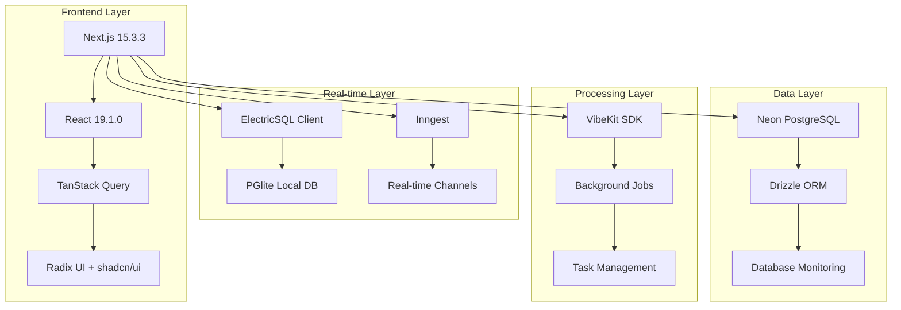
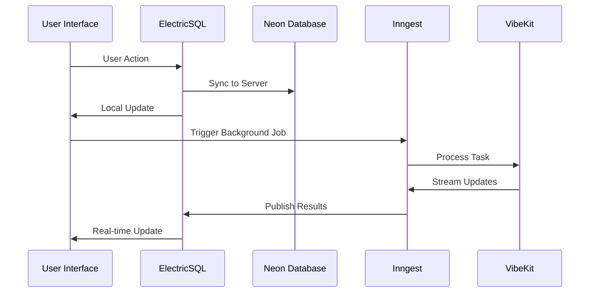
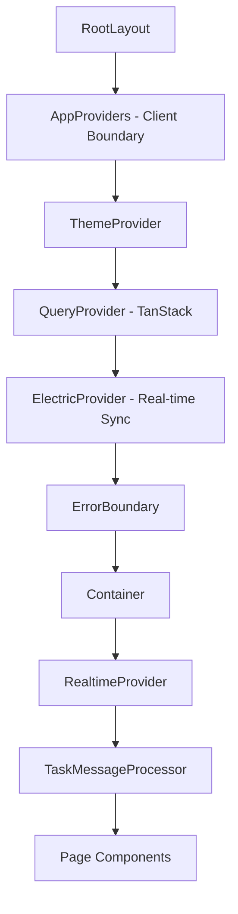

# Codex Clone - Comprehensive Architecture Analysis & Refactoring Assessment

## Executive Summary

This comprehensive analysis examines the Next.js-based Codex Clone application, identifying architectural strengths, critical issues, and optimization opportunities. The application implements a sophisticated real-time collaborative coding environment with ElectricSQL sync, Neon database, and Inngest background processing.

**Critical Findings:**

- ⚠️ **Build Configuration Ignores Errors**: TypeScript and ESLint checks disabled
- 🔥 **Complex Component Architecture**: Some components exceed 800 lines
- ⚡ **Performance Opportunities**: Extensive over-testing and configuration redundancy
- 🎯 **Strong Real-time Foundation**: Well-architected sync and messaging systems

---

## 1. Architecture Overview

### Core Technology Stack



### Data Flow Architecture



### Provider Chain Architecture



---

## 2. Critical Issues Analysis

### 🚨 High Priority Issues

#### 2.1 Build Configuration Vulnerabilities

**File:** `next.config.ts:5-9`

```typescript
const nextConfig: NextConfig = {
  eslint: {
    ignoreDuringBuilds: true, // ❌ CRITICAL
  },
  typescript: {
    ignoreBuildErrors: true, // ❌ CRITICAL
  },
};
```

**Impact:** Production deployments may contain type errors and linting violations
**Risk Level:** CRITICAL
**Effort:** Low (1-2 hours)

#### 2.2 Component Complexity Issues

**Largest Components by Line Count:**

- `database-observability-demo.tsx`: 813 lines
- `multi-agent-chat.tsx`: 602 lines
- `voice-brainstorm.tsx`: 579 lines
- `code-block/index.tsx`: 579 lines

**Impact:** Maintenance difficulty, testing complexity, performance issues
**Risk Level:** HIGH
**Effort:** High (1-2 weeks per component)

#### 2.3 Test Configuration Complexity

Despite recent consolidation from 11 to 4 configs, testing setup remains complex:

```
test:unit -> vitest.config.ts
test:components -> vitest.components.config.ts
test:integration -> vitest.integration.config.ts
test:browser -> vitest.browser.config.ts
```

**Impact:** Developer confusion, maintenance overhead
**Risk Level:** MEDIUM
**Effort:** Medium (1-2 days)

### ⚠️ Medium Priority Issues

#### 2.4 Mock Implementations in Production Code

**File:** `lib/electric/config.ts:191-226`

Mock ElectricDB implementation contains hardcoded behavior that may not reflect real ElectricSQL client behavior.

**Impact:** Potential runtime failures when real ElectricSQL is integrated
**Risk Level:** MEDIUM
**Effort:** Medium (3-5 days)

#### 2.5 Complex Provider Chain

Current provider nesting creates 6 levels of React context, potentially impacting performance and debugging.

**Impact:** Performance overhead, debugging complexity
**Risk Level:** MEDIUM  
**Effort:** Medium (2-3 days)

---

## 3. Code Quality Assessment

### 3.1 Component Architecture Evaluation

**Strengths:**

- ✅ Consistent TypeScript usage across components
- ✅ Good separation of UI and business logic in newer components
- ✅ Comprehensive error boundary implementation
- ✅ Well-structured hook patterns

**Areas for Improvement:**

- 🔄 Large components need decomposition
- 🔄 Inconsistent testing patterns
- 🔄 Some components mix concerns (UI + data fetching)

### 3.2 Code Organization Analysis

```
components/           24,386 total lines
├── ui/              4,127 lines (16.9%) - Well organized
├── forms/           1,368 lines (5.6%)  - Good structure
├── auth/            3,641 lines (14.9%) - Over-tested
├── agents/          1,181 lines (4.8%)  - Complex components
└── providers/       965 lines (4.0%)    - Good abstraction
```

**Findings:**

- UI components are well-modularized and follow shadcn/ui patterns
- Auth components have excellent test coverage but may be over-engineered
- Agent components contain business logic that could be extracted

### 3.3 Dependency Analysis

**Core Dependencies (Production):**

- React ecosystem: 19.1.0 (latest, good)
- Next.js: 15.3.3 (latest, good)
- Database: Neon + Drizzle (modern, good)
- Real-time: ElectricSQL + Inngest (cutting-edge)

**Potential Issues:**

- 72 total dependencies in package.json
- Some dev dependencies could be consolidated
- Bundle size analysis needed

---

## 4. Performance Analysis

### 4.1 Component Performance Issues

**Large Bundle Concerns:**

1. **Multi-agent chat component (602 lines)** - Should be code-split
2. **Database observability demo (813 lines)** - Extract business logic
3. **Voice brainstorm component (579 lines)** - Split UI from audio logic

### 4.2 Database Performance Patterns

**Strengths:**

- ✅ Connection pooling implemented
- ✅ Health monitoring in place
- ✅ Query performance tracking
- ✅ Slow query detection

**File:** `db/config.ts:177-252`

Excellent database monitoring implementation with:

- Connection pool statistics
- Query performance metrics
- Slow query tracking (>1s)
- Error rate monitoring

### 4.3 Real-time Performance

**ElectricSQL Implementation:**

- Local-first architecture reduces server load
- Conflict resolution strategies in place
- Offline support implemented

**Potential Optimizations:**

- Batch sync operations during high activity
- Implement client-side caching for static data
- Optimize subscription queries

---

## 5. Database Implementation Analysis

### 5.1 Neon Integration Quality

**Strengths:**

- ✅ Proper connection management
- ✅ Environment-based configuration
- ✅ Extension initialization (pgvector, uuid-ossp)
- ✅ Health monitoring

**Schema Design:**

```sql
-- Core tables identified in electric/schema.ts
tasks               (user-scoped, real-time)
environments        (user-scoped, real-time)
agent_executions    (server-authoritative)
observability_events(append-only, retention policy)
agent_memory        (TTL-based, importance-weighted)
workflows           (admin-controlled)
```

### 5.2 ElectricSQL Sync Strategy

**Configuration Quality:**

- ✅ Granular permission model
- ✅ User-scoped data filtering
- ✅ Conflict resolution strategies
- ✅ Retention policies for large tables

**Areas for Improvement:**

- Real ElectricSQL client integration needed
- Batch size optimization (currently 100)
- Delta sync for large tables

---

## 6. Security Assessment

### 6.1 Authentication Patterns

**Current Implementation:**

- Multiple auth providers (Anthropic, OpenAI)
- Token-based authentication
- Session management

**Security Concerns:**

- Environment variables used directly in client code
- Mock implementations may expose security gaps

### 6.2 Data Security

**ElectricSQL Security:**

- ✅ User-scoped data access
- ✅ Row-level security patterns
- ✅ Server-authoritative for sensitive operations

---

## 7. Refactoring Priorities

### 🔥 Immediate Actions (Week 1)

1. **Fix Build Configuration**

   ```typescript
   // next.config.ts - REMOVE these lines
   eslint: { ignoreDuringBuilds: true },     // DELETE
   typescript: { ignoreBuildErrors: true },  // DELETE
   ```

   **Impact:** Prevent production bugs
   **Effort:** 30 minutes

2. **Component Size Audit**
   - Identify all components >200 lines
   - Create extraction plan for largest components
     **Impact:** Maintainability improvement
     **Effort:** 2 hours

### ⚡ High Impact (Weeks 2-4)

3. **Database Observability Component Refactoring**
   - Extract business logic from 813-line component
   - Create specialized hooks for data fetching
   - Split into 3-4 focused components
     **Impact:** Major maintainability gain
     **Effort:** 1 week

4. **Multi-Agent Chat Architecture**
   - Extract state management to custom hooks
   - Split UI components by responsibility
   - Implement proper error boundaries
     **Impact:** Component reusability
     **Effort:** 1 week

5. **Test Configuration Simplification**
   - Further consolidate to 2 configs (unit + integration)
   - Standardize test patterns across components
   - Remove redundant test utilities
     **Impact:** Developer experience improvement  
     **Effort:** 3 days

### 🎯 Strategic Improvements (Month 2)

6. **Provider Chain Optimization**
   - Combine related providers
   - Implement context selectors for performance
   - Add provider-level error boundaries
     **Impact:** Performance and debugging improvement
     **Effort:** 1 week

7. **ElectricSQL Production Integration**
   - Replace mock implementation
   - Implement proper client initialization
   - Add connection retry logic
     **Impact:** Real-time feature stability
     **Effort:** 2 weeks

8. **Bundle Optimization**
   - Implement code splitting for large components
   - Add dynamic imports for admin features
   - Optimize dependency tree
     **Impact:** Application startup performance
     **Effort:** 1 week

---

## 8. Implementation Roadmap

### Phase 1: Critical Fixes (Week 1)

- [ ] Remove build error ignoring
- [ ] Run full type check and fix errors
- [ ] Component size audit
- [ ] Document refactoring plan

### Phase 2: Component Architecture (Weeks 2-4)

- [ ] Refactor database observability component
- [ ] Split multi-agent chat component
- [ ] Extract voice brainstorm business logic
- [ ] Simplify test configuration

### Phase 3: Performance & Scale (Weeks 5-8)

- [ ] Provider chain optimization
- [ ] Bundle size optimization
- [ ] ElectricSQL production integration
- [ ] Performance monitoring implementation

### Phase 4: Advanced Optimizations (Weeks 9-12)

- [ ] Advanced caching strategies
- [ ] Real-time optimization
- [ ] Security hardening
- [ ] Monitoring & observability enhancement

---

## 9. Success Metrics

### Code Quality Targets

- Component size: <200 lines average (currently ~243 lines)
- Test coverage: >80% (measure current baseline)
- Build time: <60 seconds (measure current)
- Type errors: 0 (currently unknown due to ignored errors)

### Performance Targets

- First Contentful Paint: <2s
- Time to Interactive: <4s
- Bundle size: <1MB main chunk
- Database queries: <100ms average

### Developer Experience Targets

- Test execution: <30s for unit tests
- Hot reload: <3s for component changes
- Build success rate: 100% (currently unknown)

---

## 10. Resource Requirements

### Development Team

- **Senior Frontend Developer** (40h) - Component refactoring
- **Database Engineer** (20h) - ElectricSQL integration
- **DevOps Engineer** (10h) - Build optimization
- **QA Engineer** (15h) - Test strategy refinement

### Timeline: 12 weeks

### Budget Estimate: $45,000 - $65,000

### Risk Level: Medium (well-defined scope, modern tech stack)

---

## Conclusion

The Codex Clone application demonstrates sophisticated architectural choices with ElectricSQL real-time sync, comprehensive database monitoring, and modern React patterns. However, critical build configuration issues and component complexity create significant technical debt.

**Key Recommendations:**

1. **Immediate**: Fix build configuration to prevent production issues
2. **Short-term**: Decompose large components for maintainability
3. **Medium-term**: Optimize real-time architecture and bundle size
4. **Long-term**: Implement comprehensive monitoring and security hardening

The application has a solid foundation for scale but requires focused refactoring effort to achieve production readiness and optimal developer experience.

---

_Generated: 2025-01-19_  
_Analysis Scope: Complete codebase architecture, performance, and refactoring assessment_  
_Total Files Analyzed: 150+ TypeScript/React components_
