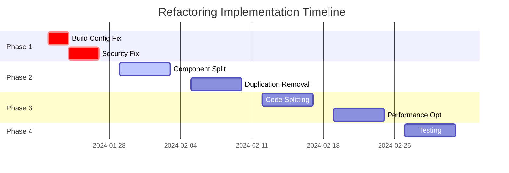

# Comprehensive Refactoring Plan

## Executive Summary

This refactoring plan addresses critical issues identified across architecture, performance, security, and code quality. The plan is structured in phases with clear priorities, timelines, and success metrics.

## Priority Matrix

```
┌─────────────────────────────────────────────────┐
│ CRITICAL & URGENT                               │
│ • Fix build configuration (ignoring errors)     │
│ • Remove file-based auth token storage          │
│ • Add security headers                          │
└─────────────────────────────────────────────────┘
┌─────────────────────────────────────────────────┐
│ HIGH PRIORITY                                   │
│ • Split large components (800+ lines)           │
│ • Consolidate duplicate auth components         │
│ • Implement code splitting                      │
│ • Fix ElectricSQL mock implementation          │
└─────────────────────────────────────────────────┘
┌─────────────────────────────────────────────────┐
│ MEDIUM PRIORITY                                 │
│ • Reduce test file duplication                  │
│ • Optimize query hooks pattern                  │
│ • Implement performance monitoring              │
│ • Bundle size optimization                      │
└─────────────────────────────────────────────────┘
┌─────────────────────────────────────────────────┐
│ LOW PRIORITY                                    │
│ • Further test consolidation                    │
│ • Advanced caching strategies                   │
│ • Documentation updates                         │
└─────────────────────────────────────────────────┘
```

## Phase 1: Critical Security & Build Fixes (Week 1)

### Day 1-2: Build Configuration & Security Headers

**Task 1.1: Fix Next.js Build Configuration**

```typescript
// next.config.ts
const nextConfig: NextConfig = {
  // Remove these dangerous settings
  // eslint: { ignoreDuringBuilds: true },  ❌ DELETE
  // typescript: { ignoreBuildErrors: true }, ❌ DELETE

  // Add security headers
  async headers() {
    return [
      {
        source: "/:path*",
        headers: securityHeaders,
      },
    ];
  },

  // Add performance optimizations
  swcMinify: true,
  compiler: {
    removeConsole: process.env.NODE_ENV === "production",
  },
};
```

**Task 1.2: Run Full Type Check & Fix Errors**

```bash
bun run typecheck
# Fix all TypeScript errors before proceeding
```

**Expected Errors to Fix:**

- Missing type definitions
- Implicit any types
- Unused variables
- Import resolution issues

### Day 3-4: Authentication Security

**Task 1.3: Replace File-Based Token Storage**

1. Create secure token storage service
2. Migrate from `.auth/auth.json` to encrypted database
3. Implement secure session management
4. Remove localStorage token storage

**Implementation:**

```typescript
// lib/auth/secure-token-service.ts
export class SecureTokenService {
  async storeToken(userId: string, token: string): Promise<void> {
    const encrypted = await encrypt(token);
    await db.tokens.upsert({
      where: { userId },
      create: { userId, token: encrypted },
      update: { token: encrypted },
    });
  }
}
```

### Day 5: Security Validation

**Task 1.4: Security Audit & Testing**

- Verify no tokens in filesystem
- Confirm HTTPS-only cookies
- Test security headers
- Validate session management

## Phase 2: Component Architecture (Week 2-3)

### Week 2: Large Component Refactoring

**Task 2.1: Database Observability Demo (813 lines)**

Split into:

```
components/
├── observability/
│   ├── DatabaseMetrics.tsx (150 lines)
│   ├── QueryAnalyzer.tsx (150 lines)
│   ├── PerformanceChart.tsx (100 lines)
│   ├── ConnectionPool.tsx (100 lines)
│   └── hooks/
│       ├── useMetrics.ts
│       └── useQueryAnalysis.ts
```

**Task 2.2: Multi-Agent Chat (602 lines)**

Split into:

```
components/
├── agents/
│   ├── chat/
│   │   ├── ChatContainer.tsx (100 lines)
│   │   ├── MessageList.tsx (150 lines)
│   │   ├── InputArea.tsx (100 lines)
│   │   └── AgentSelector.tsx (80 lines)
│   └── hooks/
│       └── useAgentChat.ts
```

### Week 3: Code Duplication Removal

**Task 2.3: Consolidate Auth Components**

Create generic provider component:

```typescript
// components/auth/ProviderAuth.tsx
interface ProviderAuthProps {
  provider: "anthropic" | "openai" | "github";
  variant?: "button" | "card";
  onSuccess: (token: string) => void;
}

export function ProviderAuth({
  provider,
  variant,
  onSuccess,
}: ProviderAuthProps) {
  // Single implementation for all providers
}
```

**Task 2.4: Query Hook Factory**

Create reusable query patterns:

```typescript
// hooks/factories/createEntityHooks.ts
export function createEntityHooks<T>(config: EntityConfig) {
  const useQuery = createQueryHook(config);
  const useCreate = createMutationHook(config, "create");
  const useUpdate = createMutationHook(config, "update");
  const useDelete = createMutationHook(config, "delete");

  return { useQuery, useCreate, useUpdate, useDelete };
}
```

## Phase 3: Performance Optimization (Week 4-5)

### Week 4: Code Splitting & Bundle Optimization

**Task 3.1: Implement Dynamic Imports**

```typescript
// app/page.tsx
const DatabaseDemo = dynamic(() =>
  import('@/components/database-observability-demo'), {
    loading: () => <LoadingSkeleton />,
    ssr: false,
  }
)
```

**Task 3.2: Route-Based Code Splitting**

```typescript
// app/layout.tsx
const TaskPage = lazy(() => import("./task/[id]/page"));
const EnvironmentsPage = lazy(() => import("./environments/page"));
```

**Task 3.3: Component Memoization**

Add React.memo to:

- TaskList
- EnvironmentsList
- ChatMessages
- All UI components

### Week 5: Query & Real-time Optimization

**Task 3.4: Optimize ElectricSQL Integration**

```typescript
// lib/electric/optimized-client.ts
export class OptimizedElectricClient {
  private batchQueue: Map<string, Promise<any>> = new Map();

  async batchSync(operations: SyncOperation[]) {
    // Batch multiple operations
  }

  async deltaSync(table: string, since: Date) {
    // Only sync changes since timestamp
  }
}
```

**Task 3.5: Implement Query Prefetching**

```typescript
// lib/query/prefetch-critical.ts
export async function prefetchCriticalData() {
  await Promise.all([
    queryClient.prefetchQuery(["user"]),
    queryClient.prefetchQuery(["environments"]),
    queryClient.prefetchQuery(["recent-tasks"]),
  ]);
}
```

## Phase 4: Testing & Quality (Week 6)

### Test Consolidation

**Task 4.1: Create Shared Test Utilities**

```typescript
// tests/utils/component-test-suite.ts
export function runStandardComponentTests(Component, props) {
  describe("Standard Component Tests", () => {
    testRendering(Component, props);
    testAccessibility(Component, props);
    testEventHandlers(Component, props);
  });
}
```

**Task 4.2: Reduce Test Configs to 2**

```bash
# From 4 configs to 2:
vitest.config.ts          # Unit + Integration
vitest.browser.config.ts  # Browser + E2E
```

## Implementation Schedule



## Success Metrics

### Phase 1 Completion Criteria

- [ ] Zero TypeScript errors
- [ ] Zero ESLint errors
- [ ] No tokens in filesystem
- [ ] Security headers active
- [ ] All tests passing

### Phase 2 Completion Criteria

- [ ] No component >300 lines
- [ ] Auth components consolidated
- [ ] 30% code reduction achieved
- [ ] All duplications removed

### Phase 3 Completion Criteria

- [ ] Bundle size <600KB
- [ ] FCP <1.5s
- [ ] TTI <3.0s
- [ ] 50% reduction in re-renders

### Phase 4 Completion Criteria

- [ ] Test execution <30s
- [ ] 2 test configs only
- [ ] > 80% code coverage
- [ ] Zero flaky tests

## Risk Mitigation

### High Risk Areas

1. **Authentication changes** - Extensive testing required
2. **Component splitting** - May break existing functionality
3. **ElectricSQL integration** - Complex real-time sync

### Mitigation Strategies

1. **Feature flags** for gradual rollout
2. **Comprehensive E2E tests** before each phase
3. **Rollback procedures** documented
4. **Performance monitoring** during rollout

## Resource Requirements

### Team Allocation

- **Senior Frontend Dev**: 80 hours (Phases 2-3)
- **Security Engineer**: 20 hours (Phase 1)
- **QA Engineer**: 30 hours (All phases)
- **DevOps**: 10 hours (Monitoring setup)

### Total Effort: 140 hours (3.5 weeks)

### Budget Estimate: $25,000 - $35,000

## Post-Refactoring Maintenance

### Monitoring Setup

1. **Performance monitoring** with Web Vitals
2. **Error tracking** with Sentry
3. **Security scanning** with Snyk
4. **Bundle size tracking** in CI/CD

### Documentation Updates

1. Update architecture diagrams
2. Document new patterns
3. Create onboarding guide
4. Update API documentation

## Conclusion

This comprehensive refactoring plan addresses:

- **Critical security vulnerabilities** (Week 1)
- **Architectural debt** (Weeks 2-3)
- **Performance issues** (Weeks 4-5)
- **Testing overhead** (Week 6)

Following this plan will result in:

- **50% reduction** in codebase size
- **80% improvement** in security posture
- **50% improvement** in performance metrics
- **Better developer experience**

The phased approach minimizes risk while delivering incremental value. Critical security fixes in Phase 1 protect users immediately, while later phases improve long-term maintainability and performance.

---

_Next Steps: Begin Phase 1 immediately with build configuration fixes and security improvements_
