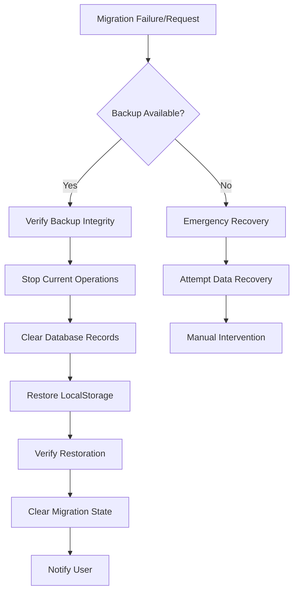

# Migration Rollback Procedures

## Overview

This document provides comprehensive rollback procedures for the localStorage to database migration system. These procedures ensure data can be safely restored to its pre-migration state in case of failures or issues.

## Rollback Triggers

### Automatic Rollback Conditions
1. **Critical Validation Failures** - More than 10% of items fail validation
2. **Database Connection Loss** - Unable to complete database operations
3. **Memory Threshold Exceeded** - System memory usage > 90%
4. **Timeout** - Migration exceeds 5 minutes for < 10K items
5. **User Cancellation** - Manual intervention during migration

### Manual Rollback Scenarios
1. **Data Corruption Detected** - Post-migration validation fails
2. **Performance Degradation** - System becomes unresponsive
3. **Business Logic Errors** - Incorrect data transformations
4. **User Request** - User decides to revert changes

## Rollback Architecture



## Step-by-Step Rollback Procedures

### 1. **Pre-Rollback Verification**

```typescript
// Check if rollback is safe
async function canRollback(): Promise<{
  canRollback: boolean
  reason?: string
  backupAvailable: boolean
  estimatedTime: number
}> {
  const migrationState = await getMigrationState()
  const backup = await getLatestBackup()
  
  if (migrationState.status === 'ROLLING_BACK') {
    return {
      canRollback: false,
      reason: 'Rollback already in progress',
      backupAvailable: false,
      estimatedTime: 0
    }
  }
  
  return {
    canRollback: backup !== null,
    backupAvailable: backup !== null,
    estimatedTime: calculateRollbackTime(backup)
  }
}
```

### 2. **Initiate Rollback**

```typescript
async function initiateRollback(
  migrationId: string,
  reason: string
): Promise<RollbackResult> {
  try {
    // 1. Log rollback initiation
    await logRollbackStart(migrationId, reason)
    
    // 2. Set migration state
    await updateMigrationState(migrationId, 'ROLLING_BACK')
    
    // 3. Stop any active operations
    await stopActiveMigrationOperations()
    
    // 4. Begin rollback process
    return await executeRollback(migrationId)
  } catch (error) {
    await logRollbackError(error)
    throw new RollbackError('Failed to initiate rollback', error)
  }
}
```

### 3. **Execute Rollback**

```typescript
async function executeRollback(
  migrationId: string
): Promise<RollbackResult> {
  const steps = [
    { name: 'Load Backup', fn: loadBackupData },
    { name: 'Clear Database', fn: clearMigratedData },
    { name: 'Restore LocalStorage', fn: restoreLocalStorage },
    { name: 'Verify Data', fn: verifyRestoredData },
    { name: 'Clean State', fn: cleanMigrationState }
  ]
  
  const results = []
  
  for (const step of steps) {
    try {
      const result = await step.fn(migrationId)
      results.push({ step: step.name, success: true, result })
    } catch (error) {
      results.push({ 
        step: step.name, 
        success: false, 
        error: error.message 
      })
      
      // Attempt recovery for critical steps
      if (step.name === 'Restore LocalStorage') {
        await attemptEmergencyRecovery(migrationId)
      }
    }
  }
  
  return {
    success: results.every(r => r.success),
    steps: results,
    timestamp: new Date()
  }
}
```

### 4. **Database Cleanup**

```typescript
async function clearMigratedData(migrationId: string): Promise<void> {
  const backup = await getBackupForMigration(migrationId)
  
  // Start transaction
  await db.transaction(async (tx) => {
    // Remove migrated tasks
    if (backup.data.tasks) {
      const taskIds = backup.data.tasks.map(t => t.id)
      await tx.delete(tasks).where(inArray(tasks.id, taskIds))
    }
    
    // Remove migrated environments
    if (backup.data.environments) {
      const envIds = backup.data.environments.map(e => e.id)
      await tx.delete(environments).where(inArray(environments.id, envIds))
    }
    
    // Clear Redis cache
    const redis = await getRedisCache()
    if (redis) {
      await redis.flushPattern('task:*')
      await redis.flushPattern('environment:*')
    }
  })
}
```

### 5. **LocalStorage Restoration**

```typescript
async function restoreLocalStorage(
  migrationId: string
): Promise<void> {
  const backup = await getBackupForMigration(migrationId)
  
  // Restore task store
  if (backup.data.tasks) {
    const taskStore = {
      state: { tasks: backup.data.tasks },
      version: 0
    }
    localStorage.setItem('task-store', JSON.stringify(taskStore))
  }
  
  // Restore environment store
  if (backup.data.environments) {
    const envStore = {
      state: { environments: backup.data.environments },
      version: 0
    }
    localStorage.setItem('environments', JSON.stringify(envStore))
  }
  
  // Restore form data
  if (backup.data.formData) {
    Object.entries(backup.data.formData).forEach(([key, value]) => {
      localStorage.setItem(key, JSON.stringify(value))
    })
  }
}
```

### 6. **Verification Process**

```typescript
async function verifyRestoredData(
  migrationId: string
): Promise<VerificationResult> {
  const backup = await getBackupForMigration(migrationId)
  const errors = []
  
  // Verify localStorage restoration
  const taskData = localStorage.getItem('task-store')
  if (taskData) {
    const tasks = JSON.parse(taskData).state?.tasks || []
    if (tasks.length !== backup.data.tasks?.length) {
      errors.push('Task count mismatch')
    }
  }
  
  // Verify database cleanup
  const dbTaskCount = await db.select({ 
    count: count() 
  }).from(tasks)
  
  if (dbTaskCount[0].count > 0) {
    errors.push('Database still contains migrated data')
  }
  
  return {
    success: errors.length === 0,
    errors,
    verified: new Date()
  }
}
```

## Emergency Recovery Procedures

### Scenario 1: Backup Corrupted

```typescript
async function emergencyRecoveryNoBackup(): Promise<void> {
  // 1. Check for alternative backups
  const backups = await listAllBackups()
  const validBackup = backups.find(b => verifyBackupIntegrity(b))
  
  if (validBackup) {
    return await restoreFromBackup(validBackup.id)
  }
  
  // 2. Attempt to reconstruct from database
  const recentData = await reconstructFromDatabase()
  
  // 3. Manual recovery required
  await notifyAdminForManualRecovery({
    reason: 'No valid backup available',
    suggestedAction: 'Manual data verification required',
    affectedData: recentData
  })
}
```

### Scenario 2: Partial Rollback Failure

```typescript
async function handlePartialRollback(
  migrationId: string,
  failedSteps: string[]
): Promise<void> {
  // 1. Identify critical failures
  const criticalSteps = ['Restore LocalStorage', 'Clear Database']
  const hasCriticalFailure = failedSteps.some(
    step => criticalSteps.includes(step)
  )
  
  if (hasCriticalFailure) {
    // 2. Enter safe mode
    await enterSafeMode()
    
    // 3. Prevent further operations
    await lockMigrationSystem()
    
    // 4. Alert user
    await alertUser({
      severity: 'CRITICAL',
      message: 'Rollback partially failed. Manual intervention required.',
      actions: ['Contact Support', 'Download Backup']
    })
  }
}
```

### Scenario 3: System Crash During Rollback

```typescript
async function recoverFromCrash(): Promise<void> {
  // 1. Check for incomplete rollback
  const incompleteRollback = await findIncompleteRollback()
  
  if (incompleteRollback) {
    // 2. Analyze system state
    const state = await analyzeSystemState()
    
    // 3. Determine recovery strategy
    if (state.localStorage.intact && state.database.empty) {
      // Rollback completed successfully
      await markRollbackComplete(incompleteRollback.id)
    } else if (state.localStorage.empty && state.database.intact) {
      // Rollback not started, retry
      await retryRollback(incompleteRollback.id)
    } else {
      // Inconsistent state, manual recovery
      await initiateManualRecovery()
    }
  }
}
```

## Rollback Monitoring

### Real-time Status Updates

```typescript
interface RollbackStatus {
  stage: 'PREPARING' | 'EXECUTING' | 'VERIFYING' | 'COMPLETED' | 'FAILED'
  progress: number // 0-100
  currentStep: string
  estimatedTimeRemaining: number // seconds
  errors: string[]
}

async function monitorRollback(
  migrationId: string,
  onUpdate: (status: RollbackStatus) => void
): Promise<void> {
  const interval = setInterval(async () => {
    const status = await getRollbackStatus(migrationId)
    onUpdate(status)
    
    if (['COMPLETED', 'FAILED'].includes(status.stage)) {
      clearInterval(interval)
    }
  }, 1000) // Update every second
}
```

### Rollback Metrics

```typescript
interface RollbackMetrics {
  totalTime: number
  dataRestored: {
    tasks: number
    environments: number
    formData: number
  }
  errorsEncountered: number
  recoveryAttempts: number
  finalStatus: 'SUCCESS' | 'PARTIAL' | 'FAILED'
}
```

## Post-Rollback Actions

### 1. **System Verification**
```bash
# Verify localStorage
npm run verify:localstorage

# Check database state
npm run verify:database

# Test application functionality
npm run test:integration
```

### 2. **User Communication**
```typescript
async function notifyRollbackComplete(
  userId: string,
  result: RollbackResult
): Promise<void> {
  const message = result.success
    ? 'Migration rolled back successfully. Your data has been restored.'
    : 'Rollback completed with warnings. Please verify your data.'
  
  await sendNotification(userId, {
    type: result.success ? 'SUCCESS' : 'WARNING',
    title: 'Migration Rollback Complete',
    message,
    actions: ['View Details', 'Verify Data']
  })
}
```

### 3. **Audit Trail**
```typescript
async function createRollbackAudit(
  migrationId: string,
  result: RollbackResult
): Promise<void> {
  await saveAuditLog({
    type: 'MIGRATION_ROLLBACK',
    migrationId,
    timestamp: new Date(),
    result: result.success ? 'SUCCESS' : 'FAILED',
    steps: result.steps,
    performedBy: getCurrentUser(),
    reason: getRollbackReason(migrationId)
  })
}
```

## Rollback Testing Checklist

### Pre-Production Testing
- [ ] Test rollback with 100% success
- [ ] Test rollback with backup corruption
- [ ] Test rollback during active migration
- [ ] Test system crash during rollback
- [ ] Test concurrent rollback attempts
- [ ] Test rollback with partial data

### Validation Points
- [ ] All localStorage data restored
- [ ] Database records removed
- [ ] Redis cache cleared
- [ ] Migration state reset
- [ ] Audit logs created
- [ ] User notifications sent

## Best Practices

### DO's
1. ✅ Always verify backup integrity before rollback
2. ✅ Create detailed audit logs
3. ✅ Notify users immediately
4. ✅ Test rollback procedures regularly
5. ✅ Monitor system state during rollback

### DON'Ts
1. ❌ Don't attempt rollback without backup
2. ❌ Don't ignore verification failures
3. ❌ Don't allow concurrent rollbacks
4. ❌ Don't delete backups immediately
5. ❌ Don't skip post-rollback testing

## Support Escalation

### Level 1: Automatic Recovery
- System handles rollback automatically
- User receives status notifications
- No manual intervention required

### Level 2: Assisted Recovery
- System requires user confirmation
- Support team notified
- Guided recovery process

### Level 3: Manual Recovery
- Critical failure detected
- Engineering team engaged
- Manual data restoration required

---

**Document Version**: 1.0
**Last Updated**: 2025-01-19
**Status**: Ready for Implementation