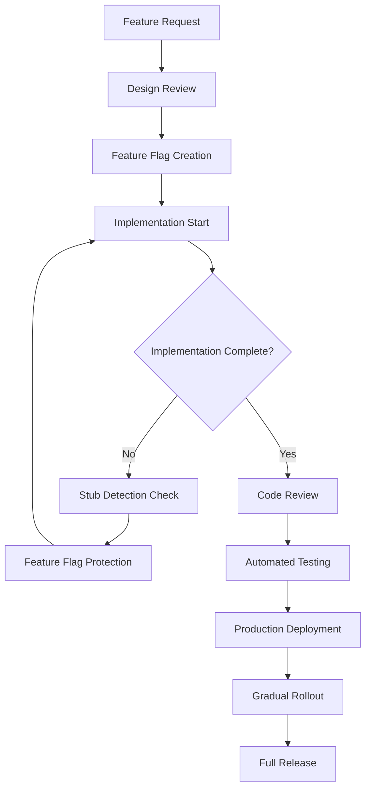

# Development Guidelines for Production-Safe Code
*Week 1 - Test Engineer Agent Design Phase*

## Executive Summary

This document establishes comprehensive development guidelines to prevent stub code, incomplete implementations, and unsafe practices from reaching production environments. These guidelines work in conjunction with automated stub detection and feature flag systems.

## Core Principles

### 1. Zero Tolerance for Production Stubs
- **No placeholder implementations** in production-bound code
- **No TODO/FIXME comments** in critical paths
- **No hardcoded test data** in production configurations
- **No mock implementations** outside of test environments

### 2. Safe Development Practices
- **Feature flags for incomplete work** - Never deploy incomplete features
- **Comprehensive error handling** - No silent failures or empty catches
- **Explicit type definitions** - Avoid `any` types that hide implementation gaps
- **Required documentation** - All public APIs must be documented

### 3. Quality Gates and Validation
- **Automated testing required** - No code without tests
- **Code review mandatory** - Peer validation before merge
- **Static analysis compliance** - Must pass all linters and type checkers
- **Performance validation** - No performance regressions

## Development Workflow

### 1. Feature Development Lifecycle



### 2. Safe Implementation Patterns

#### A. Feature Flag Protected Development
```typescript
// ✅ CORRECT: Feature flag protection for incomplete work
export async function processPayment(paymentData: PaymentData): Promise<PaymentResult> {
  const useNewProcessor = await featureFlags.isEnabled('new-payment-processor', {
    userId: paymentData.userId,
    environment: process.env.NODE_ENV
  });

  if (useNewProcessor) {
    // New implementation - may be incomplete but protected by flag
    return await processPaymentEnhanced(paymentData);
  }

  // Fallback to stable implementation
  return await processPaymentLegacy(paymentData);
}

// ❌ WRONG: Stub implementation without protection
export async function processPayment(paymentData: PaymentData): Promise<PaymentResult> {
  // TODO: Implement payment processing
  console.log('Processing payment:', paymentData);
  return { success: true, transactionId: 'mock-id' }; // STUB - DANGEROUS!
}
```

#### B. Progressive Implementation Strategy
```typescript
// ✅ CORRECT: Progressive enhancement with safe fallbacks
class UserAnalytics {
  async generateReport(userId: string, options: ReportOptions): Promise<Report> {
    const baseReport = await this.generateBaseReport(userId);
    
    // Add enhanced features progressively with feature flags
    if (await this.isFeatureEnabled('advanced-analytics', userId)) {
      try {
        baseReport.advancedMetrics = await this.generateAdvancedMetrics(userId);
      } catch (error) {
        logger.warn('Advanced analytics failed, continuing with base report', { error, userId });
        // Continue with base report - no user impact
      }
    }

    if (await this.isFeatureEnabled('real-time-data', userId)) {
      try {
        baseReport.realtimeData = await this.getRealTimeData(userId);
      } catch (error) {
        logger.warn('Real-time data unavailable, using cached data', { error, userId });
        baseReport.realtimeData = await this.getCachedData(userId);
      }
    }

    return baseReport;
  }

  // Always implement base functionality first
  private async generateBaseReport(userId: string): Promise<Report> {
    // Stable, tested implementation
    return {
      userId,
      basicMetrics: await this.getBasicMetrics(userId),
      timestamp: new Date()
    };
  }
}
```

#### C. Error Handling Requirements
```typescript
// ✅ CORRECT: Comprehensive error handling
export async function fetchUserData(userId: string): Promise<UserData | null> {
  try {
    const response = await api.get(`/users/${userId}`);
    
    // Validate response structure
    if (!this.isValidUserData(response.data)) {
      logger.error('Invalid user data structure received', { userId, data: response.data });
      throw new Error('Invalid user data format');
    }

    return response.data;
  } catch (error) {
    if (error.response?.status === 404) {
      logger.info('User not found', { userId });
      return null;
    }

    logger.error('Failed to fetch user data', { userId, error: error.message });
    
    // Rethrow for upstream handling
    throw new Error(`User data fetch failed: ${error.message}`);
  }
}

// ❌ WRONG: Silent failure or empty catch
export async function fetchUserData(userId: string): Promise<UserData | null> {
  try {
    const response = await api.get(`/users/${userId}`);
    return response.data;
  } catch (error) {
    // Empty catch - DANGEROUS!
    return null;
  }
}
```

### 3. Code Quality Standards

#### A. TypeScript Requirements
```typescript
// ✅ CORRECT: Explicit types and proper error handling
interface ApiResponse<T> {
  data: T;
  status: 'success' | 'error';
  message?: string;
}

interface UserData {
  id: string;
  email: string;
  name: string;
  createdAt: Date;
  lastLoginAt: Date | null;
}

export async function getUser(userId: string): Promise<ApiResponse<UserData>> {
  if (!userId || typeof userId !== 'string') {
    return {
      status: 'error',
      message: 'Invalid user ID provided',
      data: null as any // Explicit about the type constraint
    };
  }

  try {
    const userData = await userService.findById(userId);
    return {
      status: 'success',
      data: userData
    };
  } catch (error) {
    logger.error('User fetch failed', { userId, error });
    return {
      status: 'error',
      message: 'Failed to fetch user data',
      data: null as any
    };
  }
}

// ❌ WRONG: Using 'any' types
export async function getUser(userId: any): Promise<any> {
  try {
    return await userService.findById(userId);
  } catch {
    return null; // What went wrong? What type is this?
  }
}
```

#### B. Function Documentation Requirements
```typescript
/**
 * Processes a payment transaction with comprehensive error handling and logging.
 * 
 * @param paymentData - Complete payment information including amount, method, and user details
 * @param options - Processing options including retry settings and validation preferences
 * @returns Promise resolving to payment result with transaction ID and status
 * 
 * @throws {PaymentValidationError} When payment data is invalid or incomplete
 * @throws {PaymentProcessingError} When payment processing fails after retries
 * @throws {InsufficientFundsError} When user has insufficient funds for transaction
 * 
 * @example
 * ```typescript
 * const result = await processPayment({
 *   amount: 99.99,
 *   currency: 'USD',
 *   method: 'credit_card',
 *   userId: 'user123'
 * });
 * 
 * if (result.success) {
 *   console.log('Payment processed:', result.transactionId);
 * }
 * ```
 * 
 * @since 2.1.0
 */
export async function processPayment(
  paymentData: PaymentData,
  options: PaymentOptions = {}
): Promise<PaymentResult> {
  // Implementation with comprehensive error handling
}
```

#### C. Testing Requirements
```typescript
// ✅ CORRECT: Comprehensive test coverage
describe('UserService', () => {
  describe('getUser', () => {
    it('should return user data for valid user ID', async () => {
      const mockUser = createMockUser({ id: 'user123' });
      mockUserRepository.findById.mockResolvedValue(mockUser);

      const result = await userService.getUser('user123');

      expect(result).toEqual({
        status: 'success',
        data: mockUser
      });
    });

    it('should handle user not found gracefully', async () => {
      mockUserRepository.findById.mockResolvedValue(null);

      const result = await userService.getUser('nonexistent');

      expect(result).toEqual({
        status: 'error',
        message: 'User not found',
        data: null
      });
    });

    it('should handle database errors appropriately', async () => {
      mockUserRepository.findById.mockRejectedValue(new Error('Database connection failed'));

      const result = await userService.getUser('user123');

      expect(result).toEqual({
        status: 'error',
        message: 'Failed to fetch user data',
        data: null
      });
    });

    it('should validate input parameters', async () => {
      const result = await userService.getUser('');

      expect(result).toEqual({
        status: 'error',
        message: 'Invalid user ID provided',
        data: null
      });
    });
  });
});

// Test all error paths, edge cases, and success scenarios
```

## Anti-Patterns and Common Mistakes

### 1. Stub Code Patterns to Avoid

#### A. Placeholder Functions
```typescript
// ❌ WRONG: Placeholder implementation
export function calculateShippingCost(item: Item, address: Address): number {
  // TODO: Implement shipping calculation
  return 0; // Always free shipping - NOT REALISTIC!
}

// ✅ CORRECT: Feature flag protected implementation
export async function calculateShippingCost(item: Item, address: Address): Promise<number> {
  const useNewCalculator = await featureFlags.isEnabled('new-shipping-calculator');
  
  if (useNewCalculator) {
    return await calculateShippingCostEnhanced(item, address);
  }
  
  // Stable legacy implementation
  return calculateShippingCostLegacy(item, address);
}
```

#### B. Mock Data in Production
```typescript
// ❌ WRONG: Mock data that could reach production
export function getUserPreferences(userId: string): UserPreferences {
  if (process.env.NODE_ENV === 'development') {
    return {
      theme: 'dark',
      language: 'en',
      notifications: true
    };
  }
  
  // What happens in production? This will throw!
  return database.getUserPreferences(userId);
}

// ✅ CORRECT: Proper environment handling
export async function getUserPreferences(userId: string): Promise<UserPreferences> {
  try {
    return await database.getUserPreferences(userId);
  } catch (error) {
    logger.error('Failed to fetch user preferences', { userId, error });
    
    // Return sensible defaults, not mock data
    return {
      theme: 'light',
      language: 'en',
      notifications: true
    };
  }
}
```

#### C. Silent Failures and Empty Catches
```typescript
// ❌ WRONG: Silent failure
export async function sendNotification(userId: string, message: string): Promise<void> {
  try {
    await notificationService.send(userId, message);
  } catch (error) {
    // Silent failure - user never knows notification failed!
  }
}

// ✅ CORRECT: Proper error handling and reporting
export async function sendNotification(
  userId: string, 
  message: string
): Promise<NotificationResult> {
  try {
    await notificationService.send(userId, message);
    return { success: true };
  } catch (error) {
    logger.error('Notification delivery failed', { userId, error: error.message });
    
    // Return error info for upstream handling
    return {
      success: false,
      error: 'Failed to deliver notification',
      retryable: this.isRetryableError(error)
    };
  }
}
```

### 2. Performance Anti-Patterns

#### A. Uncontrolled Async Operations
```typescript
// ❌ WRONG: Potential memory leaks and performance issues
export async function processUserBatch(userIds: string[]): Promise<ProcessResult[]> {
  // Fires all requests simultaneously - could overwhelm system
  const promises = userIds.map(id => processUser(id));
  return await Promise.all(promises);
}

// ✅ CORRECT: Controlled concurrency
export async function processUserBatch(
  userIds: string[],
  batchSize: number = 10
): Promise<ProcessResult[]> {
  const results: ProcessResult[] = [];
  
  for (let i = 0; i < userIds.length; i += batchSize) {
    const batch = userIds.slice(i, i + batchSize);
    const batchPromises = batch.map(id => processUser(id));
    
    try {
      const batchResults = await Promise.all(batchPromises);
      results.push(...batchResults);
    } catch (error) {
      logger.error('Batch processing failed', { batch, error });
      // Handle partial failures appropriately
    }
  }
  
  return results;
}
```

### 3. Security Anti-Patterns

#### A. Missing Input Validation
```typescript
// ❌ WRONG: No input validation
export async function updateUserProfile(userId: string, updates: any): Promise<User> {
  return await database.updateUser(userId, updates); // SQL injection risk!
}

// ✅ CORRECT: Comprehensive validation
export async function updateUserProfile(
  userId: string, 
  updates: Partial<UserProfile>
): Promise<User> {
  // Validate user ID
  if (!userId || !isValidUserId(userId)) {
    throw new ValidationError('Invalid user ID provided');
  }
  
  // Sanitize and validate updates
  const sanitizedUpdates = sanitizeUserProfileUpdates(updates);
  validateUserProfileUpdates(sanitizedUpdates);
  
  // Use parameterized queries
  return await database.updateUser(userId, sanitizedUpdates);
}
```

## Code Review Checklist

### 1. Pre-Review Automated Checks
- [ ] All tests passing (unit, integration, e2e)
- [ ] TypeScript compilation successful with strict mode
- [ ] Linting rules passing (ESLint, Prettier)
- [ ] No stub detection violations
- [ ] Code coverage meets minimum thresholds
- [ ] Performance benchmarks within acceptable range

### 2. Manual Review Items

#### A. Implementation Quality
- [ ] No TODO/FIXME comments in production code paths
- [ ] All functions have proper error handling
- [ ] No hardcoded values or mock data
- [ ] Appropriate use of feature flags for incomplete work
- [ ] All async operations properly handled

#### B. Security Review
- [ ] Input validation on all user inputs
- [ ] No SQL injection vulnerabilities
- [ ] Sensitive data properly handled
- [ ] Authentication and authorization checks present
- [ ] No secrets or credentials in code

#### C. Performance Review
- [ ] No obvious performance bottlenecks
- [ ] Appropriate use of caching where needed
- [ ] Database queries optimized
- [ ] Memory usage patterns acceptable
- [ ] Network requests minimized and batched

#### D. Documentation Review
- [ ] Public APIs documented with JSDoc
- [ ] Complex business logic explained
- [ ] Error handling documented
- [ ] Usage examples provided where helpful

## Environment-Specific Guidelines

### 1. Development Environment
```typescript
// Development-specific configurations
const config = {
  // Enhanced debugging in development
  logging: {
    level: 'debug',
    includeSqlQueries: true,
    includeStackTraces: true
  },
  
  // Relaxed rate limiting for development
  rateLimiting: {
    enabled: false
  },
  
  // Feature flags default to enabled for testing
  featureFlags: {
    defaultState: 'enabled'
  }
};
```

### 2. Staging Environment
```typescript
// Production-like configuration with monitoring
const config = {
  // Production-level logging
  logging: {
    level: 'info',
    includeSqlQueries: false,
    includeStackTraces: false
  },
  
  // Production-like rate limiting
  rateLimiting: {
    enabled: true,
    strictness: 'moderate'
  },
  
  // Feature flags mirror production
  featureFlags: {
    defaultState: 'production-mirror'
  }
};
```

### 3. Production Environment
```typescript
// Strict production configuration
const config = {
  // Minimal logging for performance
  logging: {
    level: 'warn',
    includeSqlQueries: false,
    includeStackTraces: false
  },
  
  // Strict rate limiting
  rateLimiting: {
    enabled: true,
    strictness: 'strict'
  },
  
  // Feature flags conservative defaults
  featureFlags: {
    defaultState: 'disabled'
  }
};
```

## Monitoring and Observability

### 1. Required Metrics
```typescript
// Essential metrics for production code
const REQUIRED_METRICS = {
  // Performance metrics
  'response_time_p95': 'API response time 95th percentile',
  'error_rate': 'Error rate per endpoint',
  'throughput': 'Requests per second',
  
  // Business metrics
  'feature_usage': 'Feature flag usage rates',
  'user_actions': 'User interaction tracking',
  'conversion_rates': 'Business goal completion',
  
  // Health metrics
  'database_connections': 'Active database connections',
  'memory_usage': 'Application memory consumption',
  'cpu_utilization': 'CPU usage percentage'
};
```

### 2. Alerting Requirements
```typescript
// Critical alerts for production issues
const ALERT_RULES = {
  // Immediate alerts (PagerDuty)
  critical: {
    'error_rate > 5%': 'High error rate detected',
    'response_time_p95 > 2000ms': 'Response time degradation',
    'database_connection_pool_exhausted': 'Database connectivity issue'
  },
  
  // Warning alerts (Slack)
  warning: {
    'error_rate > 1%': 'Elevated error rate',
    'feature_flag_evaluation_failures > 10': 'Feature flag issues',
    'memory_usage > 80%': 'High memory usage'
  }
};
```

## Week 2 Implementation Integration

### Day 1-2: Development Environment Setup
- [ ] Configure stub detection in development tools
- [ ] Set up feature flag development environment
- [ ] Create code quality validation pipeline
- [ ] Implement automated guideline checking

### Day 3-4: Review Process Integration
- [ ] Update code review templates with quality checklist
- [ ] Integrate automated quality gates in CI/CD
- [ ] Create development team training materials
- [ ] Set up monitoring for guideline compliance

### Day 5: Production Readiness
- [ ] Validate all guidelines with production deployment
- [ ] Create incident response procedures
- [ ] Document escalation procedures for quality issues
- [ ] Establish continuous improvement feedback loop

## Conclusion

These development guidelines work in harmony with the stub detection pipeline and feature flag architecture to ensure production-safe code. By following these practices, development teams can maintain high velocity while ensuring system reliability and user safety.

The key is to make safe practices the default path, with automated tooling supporting developers in making the right choices. Week 2 implementation will focus on making these guidelines enforceable through tooling and seamless through developer experience improvements.