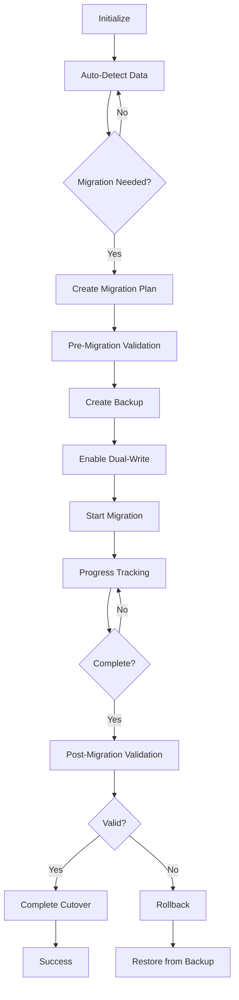

# Data Migration System

A comprehensive data migration system for moving data from localStorage to PostgreSQL with zero-downtime, validation, and rollback capabilities.

## Overview

The migration system provides:

- 🔍 **Automatic Detection** - Continuously monitors localStorage for data that needs migration
- 🚀 **Zero-Downtime Migration** - Dual-write pattern ensures no service interruption
- ✅ **Data Validation** - Comprehensive validation before, during, and after migration
- 📊 **Progress Tracking** - Real-time progress updates with detailed metrics
- 🔄 **Rollback Capability** - Complete rollback support with data recovery
- 💾 **Backup System** - Automatic backups before migration with restore capabilities
- 📈 **Status Reporting** - Detailed reports and migration analytics

## Quick Start

### 1. Initialize the Migration System

```typescript
import { migrationOrchestrator } from '@/lib/migration'

// Initialize the system
await migrationOrchestrator.initialize()

// The system will automatically detect if migration is needed
```

### 2. Check Migration Status

```typescript
import { checkMigrationStatus, checkIfMigrationNeeded } from '@/lib/migration'

// Check if migration is needed
const migrationCheck = await checkIfMigrationNeeded()
if (migrationCheck.needed) {
  console.log(`Found ${migrationCheck.itemCount} items to migrate`)
  console.log(`Storage size: ${migrationCheck.storageSize} bytes`)
  console.log(`Recommendation: ${migrationCheck.recommendation}`)
}

// Check current migration status
const status = checkMigrationStatus()
if (status.isRunning) {
  console.log(`Migration ${status.progress?.percentage}% complete`)
}
```

### 3. Plan Migration

```typescript
import { createMigrationPlan } from '@/lib/migration'

const { plan, canProceed, blockers } = await createMigrationPlan(userId)

if (canProceed) {
  console.log(`Estimated duration: ${plan.estimatedDuration}ms`)
  console.log(`Data to migrate:`, plan.dataBreakdown)
  console.log(`Recommendations:`, plan.recommendations)
} else {
  console.log(`Migration blocked:`, blockers)
}
```

### 4. Start Migration

```typescript
import { startMigration } from '@/lib/migration'

const { migrationId, cancel } = await startMigration(userId, {
  onProgress: (progress) => {
    console.log(`Progress: ${progress.processedItems}/${progress.totalItems}`)
  },
  onError: (error) => {
    console.error('Migration error:', error)
  },
  onComplete: (result) => {
    console.log('Migration completed:', result)
  }
})

// Cancel migration if needed
// await cancel()
```

### 5. Monitor Progress

```typescript
import { progressTracker } from '@/lib/migration'

// Listen for progress updates
progressTracker.on('progressUpdate', (snapshot) => {
  console.log(`Stage: ${snapshot.progress.stage}`)
  console.log(`Progress: ${snapshot.progress.processedItems}/${snapshot.progress.totalItems}`)
  console.log(`Speed: ${snapshot.metrics.itemsPerSecond} items/second`)
  console.log(`Time remaining: ${snapshot.metrics.estimatedTimeRemaining}ms`)
})

// Get current metrics
const metrics = progressTracker.getMetrics()
console.log(`Success rate: ${metrics?.successRate}%`)
```

### 6. Handle Rollback

```typescript
import { migrationOrchestrator, rollbackService } from '@/lib/migration'

// Check if rollback is possible
const canRollback = rollbackService.canRollback()
if (canRollback.possible) {
  // Perform rollback
  await migrationOrchestrator.rollbackMigration()
}

// List available rollback points
const rollbackPoints = rollbackService.listRollbackPoints()
```

## Architecture

### Core Components

1. **MigrationOrchestrator** - Central coordinator for the entire migration process
2. **AutoDetector** - Monitors localStorage and detects migration opportunities
3. **ZeroDowntimeCoordinator** - Manages dual-write and gradual cutover
4. **ValidationService** - Validates data integrity throughout the process
5. **ProgressTracker** - Tracks and reports migration progress
6. **RollbackService** - Handles rollback and data recovery
7. **BackupService** - Creates and manages backups
8. **DataExtractor** - Extracts data from localStorage with normalization
9. **DataMapper** - Maps localStorage data to database schema

### Migration Flow



## Configuration

### Migration Options

```typescript
interface MigrationConfig {
  conflictResolution: 'INTERACTIVE' | 'AUTO_SKIP' | 'AUTO_OVERWRITE' | 'AUTO_MERGE'
  backupBeforeMigration: boolean
  validateAfterMigration: boolean
  continueOnError: boolean
  batchSize: number
  retryAttempts: number
  dryRun: boolean
}
```

### Zero-Downtime Options

```typescript
interface ZeroDowntimeConfig {
  enableDualWrite: boolean
  enableGradualCutover: boolean
  cutoverPercentage: number
  syncInterval: number
  maxRetries: number
  retryDelay: number
  healthCheckInterval: number
}
```

### Progress Tracking Options

```typescript
interface ProgressConfig {
  updateInterval: number
  metricsInterval: number
  errorHistoryLimit: number
  enablePerformanceMonitoring: boolean
}
```

## API Reference

### Core Functions

#### `migrationOrchestrator.initialize()`
Initializes the migration system and starts auto-detection.

#### `migrationOrchestrator.startMigration(userId, config?)`
Starts the migration process for a user.

#### `migrationOrchestrator.rollbackMigration()`
Rolls back the current or last migration.

#### `autoDetector.detect()`
Manually triggers detection of localStorage data.

#### `progressTracker.getCurrentProgress()`
Gets the current migration progress.

#### `validationService.validateMigration(options?)`
Validates migration data integrity.

#### `backupService.createBackup(options)`
Creates a backup of current data.

#### `rollbackService.rollback(options?)`
Performs a rollback to a previous state.

### Events

The migration system emits various events:

- `migrationStarted` - Migration process has begun
- `progressUpdate` - Progress update available
- `stageChanged` - Migration stage has changed
- `errorAdded` - An error occurred
- `migrationCompleted` - Migration finished successfully
- `migrationFailed` - Migration failed
- `rollbackStarted` - Rollback initiated
- `rollbackCompleted` - Rollback finished

## Best Practices

1. **Always Create Backups** - Enable `backupBeforeMigration` to ensure data safety
2. **Validate Before Migration** - Use pre-migration validation to catch issues early
3. **Monitor Progress** - Subscribe to progress events for user feedback
4. **Test Rollback** - Ensure rollback procedures work before production use
5. **Use Zero-Downtime** - Enable dual-write for seamless migration
6. **Handle Errors Gracefully** - Implement proper error handling and user communication

## Error Handling

```typescript
try {
  const { migrationId } = await startMigration(userId)
} catch (error) {
  if (error.message.includes('blocked')) {
    // Handle migration blockers
  } else if (error.message.includes('in progress')) {
    // Handle concurrent migration
  } else {
    // Handle other errors
  }
}
```

## Testing

```typescript
// Test migration readiness
const readiness = await validateMigrationReadiness()
if (!readiness.ready) {
  console.log('Issues:', readiness.issues)
  console.log('Warnings:', readiness.warnings)
}

// Get migration statistics
const stats = await getMigrationStatistics()
console.log('Local storage:', stats.localStorage)
console.log('Database:', stats.database)
console.log('Sync status:', stats.database.syncStatus)
```

## Troubleshooting

### Common Issues

1. **Migration Stuck** - Check system health and consider stopping/resuming
2. **Validation Failures** - Review validation errors and fix data issues
3. **Rollback Failed** - Check backup availability and storage permissions
4. **Performance Issues** - Adjust batch size and sync intervals

### Debug Information

```typescript
// Generate migration report
const report = await migrationOrchestrator.generateMigrationReport()
console.log(report)

// Export progress data
const progressData = progressTracker.exportProgressData()
console.log(progressData)

// Check system health
const health = await zeroDowntimeCoordinator.checkSystemHealth()
console.log(health)
```

## Security Considerations

1. **Sensitive Data** - Ensure proper encryption for tokens and passwords
2. **Backup Storage** - Secure backup data appropriately
3. **Access Control** - Implement proper user authorization
4. **Data Validation** - Validate all data to prevent injection attacks

## Performance Tips

1. **Batch Processing** - Adjust `batchSize` based on data volume
2. **Sync Intervals** - Tune `syncInterval` for optimal performance
3. **Progress Updates** - Adjust `updateInterval` to reduce overhead
4. **Health Checks** - Configure `healthCheckInterval` appropriately

## Support

For issues or questions:
1. Check the troubleshooting guide
2. Review error messages and logs
3. Generate a migration report
4. Contact support with relevant details